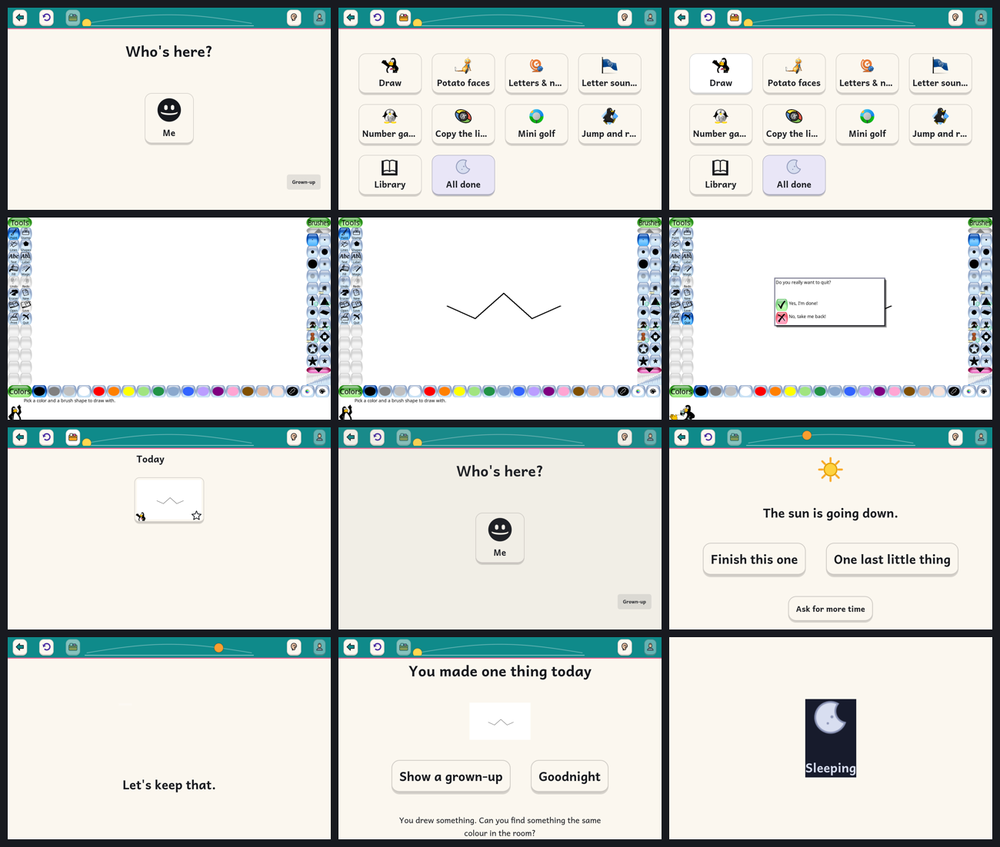

# kidnix

**An operating system built exclusively for young children.**
Immutable, bootc-based Linux · full-screen activity shell · a Journal instead
of files · bounded sessions · read-aloud everything · zero telemetry · no
browser, no store, no feeds.

> **Status: 2026-08-23, after checkpoint 2.** The image builds and boots into
> the kiosk shell; the child session is locked down at the image level and the
> "it cannot be broken" claim is now tested — a deliberately unhealthy update
> rolls itself back in a VM, unattended, in under four minutes
> (`just test-rollback`). Home carries a real tile set: **Draw** (Tux Paint),
> **Sounds & words**, **Letters & numbers** (a shelf of 18 curated GCompris
> children), **Potato faces**, **Copy the lights**, **Numbers**, **Clock**,
> **Letters** (to family, with the reply coming back into My Things), **Mini
> golf** and a few more, filtered per child by age band and the parent's
> allow-list. Four of those are written here, on our own activity SDK. There is
> a **parent panel** — a real GTK app on the grown-up's desktop, seven pages,
> and no dashboard of the child anywhere in it. Read-aloud is a pre-rendered
> voice for the shell's closed vocabulary with Piper behind it for anything
> dynamic, every spoken line is captioned, and the strings are extracted for
> translation (ADR-0012). 30 end-to-end tests drive a real VM by fake mouse and
> keyboard.
>
> **Nothing here has been tested with a child yet.** That is the next thing,
> and it is the only claim in this README that matters.



*Seventeen frames from the automated end-to-end test (`just test-e2e`): a real VM, driven by QEMU input events, drawing in Tux Paint, the drawing landing in My Things, the voice note on "Let's keep that", and the machine ending the session in daytime words. The Home in these frames predates the four first-party tiles.*

## Why

Children aged ~4–8 deserve a computer that is theirs: one that teaches real
computing (keyboard, pointer, making things) without the attention economy that
comes bundled with tablets and app stores. Existing "kid modes" are afterthoughts
on adult platforms; existing kid Linux distros are school labs or abandoned.
kidnix is an attempt to do this properly, grounded in the current
child–computer-interaction and child-development evidence.

## What it is (target)

- A **bootc image** (`ghcr.io/mattcree/kidnix`) on the Universal Blue / Fedora
  Atomic base: unbreakable root, atomic updates, rollback.
- A child user auto-logs into a **kiosk activity shell**: a handful of big,
  spoken, concrete activities; one thing at a time; a Journal of what was made;
  a visible session timer with a gentle ending.
- Activities: some curated (Tux Paint, GCompris, KTuberling, Blinken, Kolf,
  Kiwix), some written here on our own SDK (Sounds & words, Numbers, Clock,
  Letters to family). Still to come: a story-maker, music, photos, Listen.
  See [`docs/plan/SUITE.md`](docs/plan/SUITE.md).
- A parent account with a normal GNOME desktop and a **parent panel**:
  allow-lists, time budgets, journal view, no surveillance.

## Where to read next

| | |
|---|---|
| [`docs/PARENTS.md`](docs/PARENTS.md) | The page to keep by the kettle. One page, no commands, for the person who switches the machine on. |
| [`docs/plan/SUITE.md`](docs/plan/SUITE.md) | What a child can do, and in what order we build it — the narrow-and-deep bet on literacy. |
| [`docs/plan/CHECKPOINT-2.md`](docs/plan/CHECKPOINT-2.md) | Where the build actually stands, finding by finding, and the list before child test #1. |
| [`docs/design/FLOWS.md`](docs/design/FLOWS.md) | Every flow through the machine, from a child's side and a parent's. |
| [`docs/BUILDING.md`](docs/BUILDING.md) | How to build, boot, test and debug it. |
| [`AGENTS.md`](AGENTS.md) | The design constitution and the working conventions. |
| [`docs/research/`](docs/research/) | The evidence base; start at `SYNTHESIS.md`. |
| [`docs/adr/`](docs/adr/) | The decisions, with their reasons. |

## Quick start (developers)

```sh
just --list                # everything you can do
just ci                    # lint + build + image tests + licences (rootless)
just build-qcow2-rootless  # a bootable disk, still no sudo
just vm                    # boot it in qemu/KVM
just test-e2e              # drive the shell in a real VM (~10 min, 30 tests)
```

`just build-qcow2` builds a *customised* disk (parent password, SSH key) and is
the one step that needs `sudo`.

## Licence

Apache-2.0 for kidnix code (see `LICENSE`). Bundled third-party content keeps
its own licences, recorded in `docs/LICENSES.md`.
