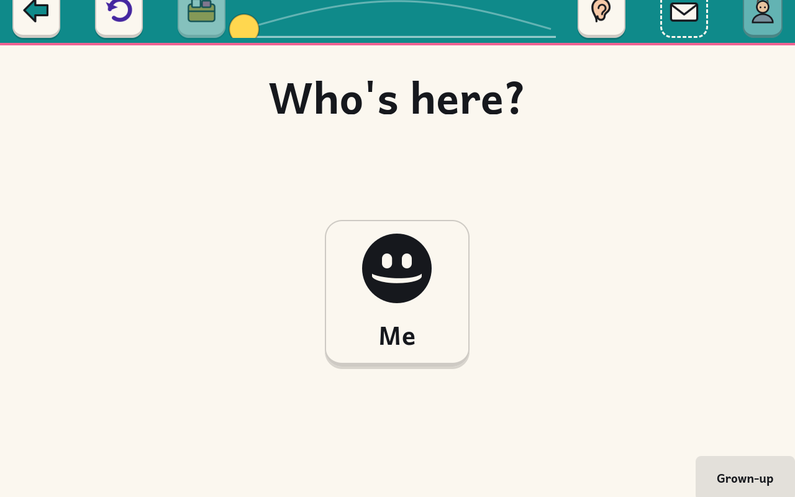

# kidnix

**An operating system built exclusively for young children.**
Immutable, bootc-based Linux · full-screen activity shell · a Journal instead
of files · bounded sessions · read-aloud everything · zero telemetry · no
browser, no store, no feeds.

> Status: day one (2026-08-22). The image builds, boots into the kiosk shell
> in a VM, and the child session is locked down at the image level. Nothing
> here has been tested with a child yet.



## Why

Children aged ~4–8 deserve a computer that is theirs: one that teaches real
computing (keyboard, pointer, making things) without the attention economy that
comes bundled with tablets and app stores. Existing "kid modes" are afterthoughts
on adult platforms; existing kid Linux distros are school labs or abandoned.
kidnix is an attempt to do this properly, grounded in the current
child–computer-interaction and child-development evidence.

## What it is (target)

- A **bootc image** (`ghcr.io/mattcree/kidnix`) on the Universal Blue / Fedora
  Atomic base: unbreakable root, atomic updates, rollback.
- A child user auto-logs into a **kiosk activity shell**: a handful of big,
  spoken, concrete activities; one thing at a time; a Journal of what was made;
  a visible session timer with a gentle ending.
- Activities (v1 intent): draw/paint (Tux Paint), GCompris, a keyboard game, a
  story-maker, music, photos, block coding, letters-to-family, an offline
  library.
- A parent account with a normal GNOME desktop and a **parent panel**:
  allow-lists, time budgets, journal view, no surveillance.

See [`AGENTS.md`](AGENTS.md) for the design constitution and working
conventions, [`docs/research/`](docs/research/) for the evidence base,
[`docs/plan/`](docs/plan/) for the roadmap, and
[`docs/BUILDING.md`](docs/BUILDING.md) for how to build and boot it.

## Quick start (developers)

```sh
just --list        # everything you can do
just ci            # lint + build image + image tests (rootless)
just build-qcow2   # needs sudo once (bootc-image-builder)
just vm            # boot it in qemu/KVM
```

## Licence

Apache-2.0 for kidnix code (see `LICENSE`). Bundled third-party content keeps
its own licences, recorded in `docs/LICENSES.md`.
