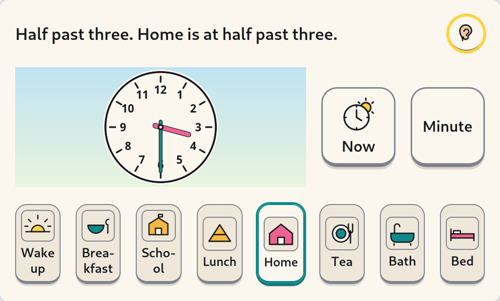
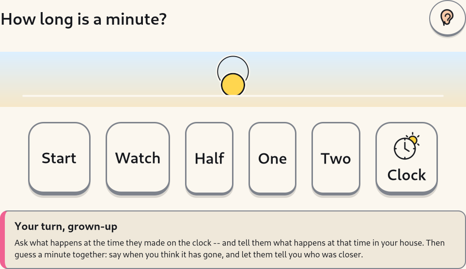

# Clock — playing with a clock, and how long a minute is (`clock_time`) — v1

> Implementer's design note, 2026-08-23. `docs/plan/ACTIVITY-IDEAS.md` (Matt,
> 2026-08-22) asked for three things under **Clock & time**: (a) *play with the
> clock* — move the hands, the scene changes with this family's routine, it
> speaks "half past three", and a real-time mode; (b) *what time is it?*
> practice, which is curated GCompris and is being done elsewhere; (c) *timers
> you can see* — "how long is a minute", in the same visual language as the
> session sun. This note covers (a) and (c), which are built, in
> `activities/clock_time/`. Everything below is implemented and asserted in
> `activities/clock_time/tests/` unless a sentence says otherwise — and where
> something is **not** built, §12 says so in as many words.

The one-line acceptance test for the whole activity:

> *A Year 1 child can put the hands on half past three, hear it said, see that
> half past three is when they come home, and find the clock they made in My
> Things.*



## 0. The honest goal line

```
Playing with a clock: o'clock and half past, and what happens when. Not a test.
```

That is the manifest's `goal`, it is the sentence the whole activity is held
to, and the last clause is the load-bearing half. Ten minutes of moving two
hands is practice, not a curriculum; nothing here is marked, timed against a
target, scored or recorded against the child, and a test asserts that the goal
line claims none of those things.

## 1. Why a clock, and why a *routine* beside it

Three findings, and the third is the one that shapes the screen.

**Year 1 is where the statutory content is.** National Curriculum KS1
Measurement asks Year 1 to *"tell the time to the hour and half past the hour"*
— quoted in `docs/spikes/gcompris-curation.md`, which rejected GCompris's own
`clockgame` levels 3+ for going past it. Year 2 adds quarter past, quarter to
and the five-minute marks. **Caveat, stated plainly:** the Year 1 wording is the
only one sourced *inside this repository*; the Year 2 wording is taken from the
national curriculum directly and has no in-repo citation yet (§12).

**A five-year-old does not read a timeline.** 09 Q1: Tillman, Tulagan, Fukuda &
Barner (2018) found that *"unlike kindergarteners and adults, most preschoolers
did not represent time as a directional spatial line"*, and the ruling that
follows is to *"encode depletion as shrinking filled area / falling height, not
horizontal travel"*. 09 Q4 goes further: *"never ask the child to order
anything. No timeline graphic, no drag-to-reorder."* Both bind the minute screen
and the routine strip, and §4 and §5 say how.

**Context is what actually ends screen time.** 02 #18: *reflect real-world
context, since context is what actually ends screen time — 39% of transitions
ended because the situation changed.* This is why the routine strip exists and
why it is not decoration. "Half past six" is an abstraction. "Half past six is
when we have tea" is a fact about the child's own house, and it is the sentence
the activity is really teaching.

## 2. Two screens, and what is not on them

| | |
|---|---|
| **Play with the clock** | a teaching dial, this family's day, a `Now` button |
| **How long is a minute?** | a disc that shrinks and sinks, and three words about how it went |

And what is deliberately absent, everywhere: no score, no star, no streak, no
level, no "well done", no red, no pulse, no countdown with anything at stake, no
digits in anything spoken or captioned, and no way out of the activity's own —
Back is the band's, one screen up, in every activity
(`docs/design/activity-sdk.md` §3.4).

## 3. Play with the clock

### 3.1 Three routes to the same place

SYNTHESIS **A5** asks for *"drags short, with pick-up/drop state cues and a
click-move-click fallback."* This is built to that rule read in the child's
favour rather than as a minimum — there are three routes and **drag is the
third**:

1. **Press a rim target.** One 20 mm target per position the child's year has
   been taught: two in Year 1 (`o'clock`, `half past`), twelve in Year 2. Each
   carries its own spoken name, each is in the Tab ring, each is invisible until
   a hand or a focus ring touches it — the child sees a clock, not a clock with
   twelve buttons stuck to it. This is click-move-click with the move taken out.
2. **Press anywhere on the face.** The angle is snapped to the same grid, so
   there is no near-miss and no precision to have.
3. **Drag a hand.** Works, never required.

All three land in the same pure function, `dial.total_from_point`, and all three
snap. Two properties of that function are worth stating because they are what
make it feel like a real clock rather than a widget:

* **The hands take the short way round.** The minute comes from the angle; the
  *hour* is whichever of the three candidates (this hour, the one before, the
  one after) leaves the hands nearest to where they already were. Tapping twelve
  from ten to four is four o'clock, not three.
* **A tie does not go backwards.** Pressing "half past" from three o'clock is
  half past *three*.

The targets, the sizes and the debounce are all the SDK's: everything a child
touches is a `ChildButton` underneath, so it fires on press, from any mouse
button, once however hard it is hit, with no double-click, right-click or
long-press anywhere (SYNTHESIS A2/A3).

### 3.2 The grid is the year band, and the year band is the parent's

`words.Mode` has two values and there is **no third way to change it**: no
inference, no advancement, no "unlock". A child shown "twenty-five to eight" in
the term they are learning "o'clock" has been shown something their school has
not taught, and nothing in an activity is entitled to decide that. It is the
same rule Sounds & Words' ceiling keeps, for the same reason. The default is
Year 1, because starting low costs nothing.

| Mode | Grid | Face |
|---|---|---|
| `y1` (default) | o'clock, half past | twelve hour marks |
| `y2` | every five minutes | hour marks **and** sixty minute ticks |

The minute ticks are drawn only in Year 2 on purpose. A Year 1 face has nowhere
on it that is not o'clock or half past, so sixty ticks would be sixty positions
the child is not being asked about — decoration that looks like information,
which is exactly what 05 §2c (Kaminski & Sloutsky) warns about.

### 3.3 The words

`ClockTime.words()` is the one string the voice and the caption share, and every
one of the 720 positions on the dial has one. UK usage throughout: *five past*,
*quarter past*, *twenty-five past*, *half past*, *twenty-five to*, *quarter to*,
*five to*; *twelve o'clock* for both noon and midnight, because a dial has no
zero on it.

**Words, never digits.** A test walks all 720 positions and asserts that no
string contains a digit. The numerals 1–12 on the dial are the one place in
kidnix where a digit is shown to a child on purpose — reading them is the thing
Year 1 is being taught — and 01 #19 / 03 #32's rule is about *quantities of time
remaining* ("about as long as one story", never "twelve minutes"), which the
voice here never utters.

### 3.4 `Now`

Jumps the hands to the real time and says it. Real time is almost never on the
grid, so the hands land where they really are and the voice **hedges**: "Right
now it is about half past three." Saying "half past three" at twenty-six minutes
past would teach a child that the words mean something looser than they do. One
press of an arrow key tidies the hands back onto the grid.

## 4. What happens when

Six to eight moments, each with a time, a name and a picture, from the grown-up's
file (§6). The strip runs along the bottom; the one the hands are showing has a
ring round it and has come forward; the sky behind the clock face changes with
the time of day; and the prompt across the top is the whole sentence —
*"Half past three. Home is at half past three."*

Pressing a moment moves the hands to it, which is the same link read the other
way round: *bath is at half past six* and *half past six is bath*.

### 4.1 It is not a timeline

09 Q4 is explicit and the strip obeys it: the child is **never asked to order
anything**, nothing in it is draggable, and the left-to-right arrangement is
convenience for the adult reading over the child's shoulder. What carries *when*
is the hands, the highlight and the sky — three channels, none of them
positional and none of them colour alone (SYNTHESIS B6). If the strip were
shuffled the activity would still work.

There is deliberately **no separate scene card**. An earlier version had one — a
picture, a name and the sky, beside the clock — and it was cut: it was a fourth
copy of what the prompt, the strip and the sky already said, and a fourth copy
is clutter rather than emphasis. Every object on a screen is one more thing a
four-year-old has to decide is not the thing to press.

### 4.2 The dial has no am and no pm

Seven o'clock is either getting up or going to bed and the hands say nothing at
all about which. Two rules decide it, in order:

1. **The room, when we know what time it is there.** The candidate nearer to the
   *real* clock wins, because that is what an adult sitting next to the child
   would assume: at six in the evening, seven o'clock means bedtime. This matters
   more than it looks — with a default day whose morning is crowded and whose
   evening is not, rule 2 alone makes "bed" unreachable, and a routine strip with
   an item nobody can land on is a strip with a lie in it.
2. **Otherwise, the tighter fit.** The candidate that lands closer *behind* a
   routine moment. At three o'clock the afternoon candidate is three hours after
   lunch and the small-hours one is eight hours after bed, so the afternoon wins.

"What is happening now" is the **most recent thing that started**, not the
nearest one: at four in the afternoon a child has been home from school for half
an hour and is not yet having tea, and the honest picture is the one they are
living in.

### 4.3 The sky

Four, because a day has four of them to a child: morning (05:00–11:59),
afternoon (12:00–16:59), evening (17:00–20:59), night. Not configurable — a
parent who moves bedtime moves the *routine moment*, and the sky follows the
clock, which is the direction the causation actually runs.

The dial reads on all four because every ring on it is stroked **twice**, ink
inside and paper outside. That is `kidnix_shell.sun`'s argument transplanted: no
single fill clears 3:1 against four different grounds, so the outline carries
WCAG 1.4.11 — and the night sky is dark enough that an ink rim alone would be
1.6:1 against it.

## 5. How long is a minute?



This is the half with the sharpest constraint on it. SYNTHESIS **D6**: *"no
fabricated time pressure. Countdown timers with no real stake are a named
manipulative pattern. The session timer is real; nothing else should imitate
it."* 02 §2.8: a timer for a five-year-old is *"not an information display, it
is an emotional object"*, and a visible countdown *"can itself generate
anticipatory anxiety"*.

So this is **not a countdown**, and three decisions keep it from becoming one:

1. **Nothing is at stake and nothing ends.** No deadline arrives, nothing is
   lost, and the child decides when it stops. The disc is a record of time that
   has passed, not a warning about time that has not.
2. **The guess is made with the picture hidden.** A disc that shrank over
   exactly the interval the child was asked to *judge* would be showing them the
   answer, and this would be a reaction test. So while the child is timing,
   nothing depletes — what is drawn is the outline of a whole interval, so they
   can see what they are aiming at without being told when they have got there.
   The disc comes back afterwards, as the **explanation**.
3. **There is a "Watch" that is not a test at all.** The same disc runs with
   nobody being asked anything. A child who wants to see a minute go past may
   simply watch one.

### 5.1 The shape is the shell's sun, not a cousin of it

The panel's one-sun ruling of 2026-08-23 (`kidnix_shell/band.py`) exists because
three different suns had been drawn on screens a child sees within four minutes.
`clock_time.minute` restates `kidnix_shell.sun`'s geometry rather than importing
it, so that the pure half of this activity stays importable on a machine with no
shell and no GTK — and `tests/test_sun_agreement.py` re-derives **every** number
from the original wherever the shell *is* importable and fails on any
difference. It shrinks and sinks in place, never travels sideways, never
vanishes, never turns red and never pulses (09 Q1; 08 §4.6).

The one thing it does **not** borrow is `SUN_WARM_FILL`. That is the session's
last-window signal — "the light has changed" — and nothing in this activity is
ending, so the activity has no business wearing it. A test asserts the constant
is absent.

### 5.2 Three words, and not one number

| Elapsed, as a fraction of the interval | What it says |
|---|---|
| below 0.75 | "a bit early" |
| 0.75 to 1.25 inclusive | "just right!" |
| above 1.25 | "a bit late" |

The bands are wide on purpose: 02 §2.8 finds duration judgement at this age
*"immature and highly susceptible to emotional and attentional state"*, so a
band a five-year-old lands in only by luck would be measuring luck. A quarter
either way is what an adult would call "about right", and both boundaries are
inclusive at the generous end.

None of the three is praise or blame — "a bit early" describes the interval, not
the child — and none contains a digit, a second, a percentage, a best-ever or a
streak (SUITE §5, SYNTHESIS E1). There is deliberately no fourth band for "a
very long way out": a child who sat for four minutes was doing something else,
and the activity has nothing useful to say about that which is not a judgement.

Three intervals are offered — half a minute, a minute, two minutes — named and
never numbered. A child who has only ever judged one interval has learnt a
reflex rather than a duration, and "two minutes" is the phrase adults actually
use at the end of a session, so it is worth having a picture of.

## 6. The grown-up's file

Root-owned, read in this order — `/etc` first because bootc's three-way merge
makes `/etc` theirs and `/usr/share` ours:

```
/etc/kidnix/clock_time.toml          the parent's copy
/usr/share/kidnix/clock_time.toml    the image's default
```

Root-owned because the child owns `$XDG_CONFIG_HOME`, and a year band a child
can edit is not a statement about what their school has taught.

```toml
[clock]
# "y1" -- o'clock and half past (the default)
# "y2" -- the quarters and the five-minute marks as well
mode = "y1"

# Six to eight moments, in any order; they are sorted by time.
[[routine]]
id      = "tea"      # a slug; also the picture's filename
name    = "Tea"      # what this family calls it. Spoken and written.
time    = "17:30"    # 24-hour, "HH:MM" (a full stop works too)
picture = "tea"      # optional; defaults to `id`
```

| Field | Rule |
|---|---|
| `clock.mode` | `y1` / `y2`, case- and space-insensitive, `year 1` accepted. Anything else → `y1`, with a line in the log. |
| `routine[].id` | required. Also the picture's stem unless `picture` says otherwise. |
| `routine[].name` | optional; defaults to the id, tidied. |
| `routine[].time` | required, `HH:MM`. Unparseable → that entry is dropped. |
| `routine[].picture` | optional. A name we have no drawing for shows the word alone — a family may rename "tea" to "dinner" today and get a drawing for it later. |

Eight moments is the cap. A ninth would take the strip below ADR-0011's 20 mm
floor on the panel kidnix ships for, and a target under the floor is not a
target, so extras are dropped with a line in the log rather than squeezing the
rest.

**Nothing here ever raises.** A missing file, a malformed one, a typo in a time,
a list where a table should be — all come back as the defaults with a line in
the log. A five-year-old told the computer is broken because a grown-up mistyped
a TOML key has been failed twice. Partial credit is deliberate: a file with a
good `[clock]` and one broken routine entry keeps the mode and keeps the seven
good moments.

The drawings that ship are `wake`, `breakfast`, `school`, `lunch`, `home`,
`tea`, `bath`, `bed`. They are plain on purpose — one object, flat colour, no
scene, nothing countable in them — because 05 §2c (Kaminski & Sloutsky) finds
that perceptual richness makes children attend to the decoration rather than to
what it stands for, and a routine tile is exactly a picture that stands for
something.

## 7. The Journal card

On SIGTERM, and only if the child actually played:

```
kind     "picture"
files    v001.png   the clock they left it on, on its sky, 512 px
         v002.svg   the routine drawing that goes with it
caption  "Half past three"        -- becomes the card's title
meta     time / mode / routine / sky
```

A card for a session in which nobody touched anything would be a claim about a
person that is not true, so `played` gates it — the same rule `--screenshot`
keeps.

The sky is in the picture because the card is a record of *what the child made
the clock say*, and "half past five, in the evening" is a more honest record of
an afternoon's play than a floating dial. The caption is words, never digits,
and it is what My Things reads aloud.

## 8. The keyboard

SYNTHESIS A6 — the keyboard is never *required*; everything here can be done by
pressing something. The activity takes **two** keys back from the SDK's focus
ring and leaves the rest alone:

| | |
|---|---|
| Tab / Shift-Tab | the SDK's. Walks every control, in reading order. |
| Enter | the SDK's. Presses whatever the ring is on. |
| Left / Right / Up / Down | **ours.** One position round the rim. |
| Space | **ours.** `Now` on the clock screen; start or stop on the minute one. |
| Escape, Backspace | **nobody's here.** They belong to the shell. |

Taking the arrows costs arrow-key navigation of the ring. It is worth it because
moving the hands is the *content* of this activity and a ring position is not,
and because Tab still walks everything, so no control has become unreachable.

The composition is done by wrapping `ActivityKeyboard.key` on the instance
rather than adding a second capture-phase controller: there is one dispatcher,
and the activity is in front of it. Two controllers on the same widget would be
two orders that have to agree.

## 9. Millimetres, and the rectangle we were actually given

Every size comes from `ContentArea`, so a rim target is 20 mm of real panel on
any monitor and no label is under 18 pt. Three things in this layout are worth
recording because each was a measured bug rather than a preference:

* **The face yields.** The brief gives the clock 60% of the content height. On a
  1024 × 618 rectangle (the Broadway default, and not far off the VM's
  1280 × 708) that is a request the screen cannot honour once a prompt and eight
  routine tiles have had their minimums. The honest failure is to *yield*, not to
  overflow — under gnome-kiosk what falls off the bottom of an over-tall window
  is the routine strip, the half of this activity that is not a clock. So the
  face takes the smaller of 60% and what is left, never less than three targets,
  and **logs the shortfall**, which is what `docs/design/activity-sdk.md` §13.3
  asks an overflowing activity to do.
* **Minimums, not naturals.** GTK will not shrink a widget below its minimum, and
  every SDK control carries a 20 mm-or-more size request. The first version of
  this window asked for 1074 × 890 in a 1024 × 618 rectangle because two 40 mm
  buttons were *stacked* beside the clock and the routine strip was budgeted
  against the screen width rather than the content box. Both are now measured
  (`_reserved`, `_strip_mm`) and a test asserts the whole tree's minimum fits in
  both directions on both screens.
* **The grown-up's card is on the minute screen.** SUITE §3's co-use moment has
  to be somewhere, and four rows — prompt, face, strip, card — do not fit. Of the
  four it is the one whose absence costs a child nothing, it is one press away,
  and it names both screens. The clock screen's own co-use prompt is the sentence
  already written across the top of it.

One correction to the SDK's own labels lives here too: `fit_gtk_label` works out
how a word wraps and at what point size, and GTK then asks the label how wide it
would *like* to be — answering with `max-width-chars` times an average character
computed for a narrower face than kidnix draws in. Inside a centred box that
answer is also the allocation, so "Watch it" came out as "W-atc-h it". Handing
the measured width back as a size request (capped at the room the control
actually has) closes the loop.

## 10. Tests

371 at the time of writing; `uv run pytest` and `uv run ruff check` are green.

| File | What it holds down |
|---|---|
| `test_words.py` | every o'clock, half past, quarter and five-minute case; "twelve o'clock"; "half past twelve"; snapping in both modes, including the wrap over twelve and the tie; stepping; the hedge; **no digit in any of the 720 spoken strings** |
| `test_routine.py` | the day, `HH:MM` parsing, the four skies, the am/pm resolution with and without the room's own clock, "the last thing that started" |
| `test_settings.py` | the search path, partial credit, the eight-item cap, and that the shipped default file says exactly what the code's default day says |
| `test_minute.py` | every band boundary; that no verdict carries a digit, a score or a judgement; that the disc never travels, never vanishes and is clamped |
| `test_keys.py` | the whole key table, and that Escape and Backspace are never ours |
| `test_dial.py` | where a tap lands (including in Year 1, where nothing may land between the two positions), and the drawing — rendered to a cairo surface and counted, because a screenshot somebody eyeballs once is not a test |
| `test_sun_agreement.py` | every constant and every geometry re-derived from `kidnix_shell.sun` |
| `test_activity_css.py` | the palette against `theme.css`; that a rim target still answers a hand; that nothing here is red or animates |
| `test_manifest.py` | the shell's own validator, plus the honesty tests on the goal line |
| `test_gtk_smoke.py` | under a Broadway daemon it starts itself, and skips the file if there is not one: the tree builds, the targets are named and land on the marks, both screens fit the rectangle, and one played session produces one Journal card |

Headless tests are the floor and never skip. The words, the snapping, the
routine lookup, the bands and **the whole of the drawing** are exercised with no
display — `cairo` imports without one, which is why `dial.py` has no GTK in it.

## 11. Installing it

Not on the image yet, deliberately: `manifest.toml` is not in
`system_files/usr/share/kidnix/activities/`, so the tile does not exist. A tile
that opens a half-built activity is worse than no tile. A later image wave needs
three things:

1. `clock_time/` copied beside the shell, as `build_files/60-shell.sh` copies
   `kidnix_activity` — the manifest's `icon` path
   (`/usr/lib/kidnix/clock_time/icon.svg`) has to be where that copy lands;
2. `clock_time.toml` installed to `/usr/share/kidnix/`;
3. `manifest.toml` into `/usr/share/kidnix/activities/`, and
   `kidnix-activity validate` run over it in CI (which `tests/test_manifest.py`
   already does).

## 12. Still open after this pass

1. **Year 2's curriculum wording has no in-repo source.** Year 1's is quoted in
   `docs/spikes/gcompris-curation.md`; the quarters and five-minute marks are
   taken straight from the national curriculum and nothing in `docs/research/`
   backs them. 05 covers EYFS number and KS1 arithmetic and is silent on time.
   Somebody should put the KS1 Measurement text in the research corpus properly.
2. **Long routine names wrap on a narrow panel.** At eight tiles on a 1024 px
   panel the label box is about 70 px, so "Breakfast" and "School" break
   mid-word. They are legible, they are spoken, and the names are
   parent-configurable — but the fix is either a shorter shipped default or a
   `PictureTile` that can put its label outside its own box.
3. **The face never reaches 60% on the panels we have.** §9 explains why and the
   shortfall is logged. Getting there needs the routine strip to cost less
   height — two rows of four is worse, and a strip with no labels breaks B4, so
   this wants a real answer rather than another guess.
4. **Nothing is remembered between sessions.** No progress file, no "last time
   you made", no spacing. That is a deliberate v1 omission and not obviously
   wrong: the activity is play, and the only thing worth keeping is already kept
   in the Journal.
5. **The routine is a strip, not a day.** There is no "what comes next", no
   duration between moments, and no way for a child to ask "how long until tea"
   — which is the question they actually have. It is also the question most
   likely to need 09 Q1's area encoding rather than a clock face, so it belongs
   with the minute screen's language and not the dial's.
6. **`--demo` and `exec_resume` are unwired**, exactly as the SDK leaves them.
   The activity writes `meta.json` and nothing reads it back.
