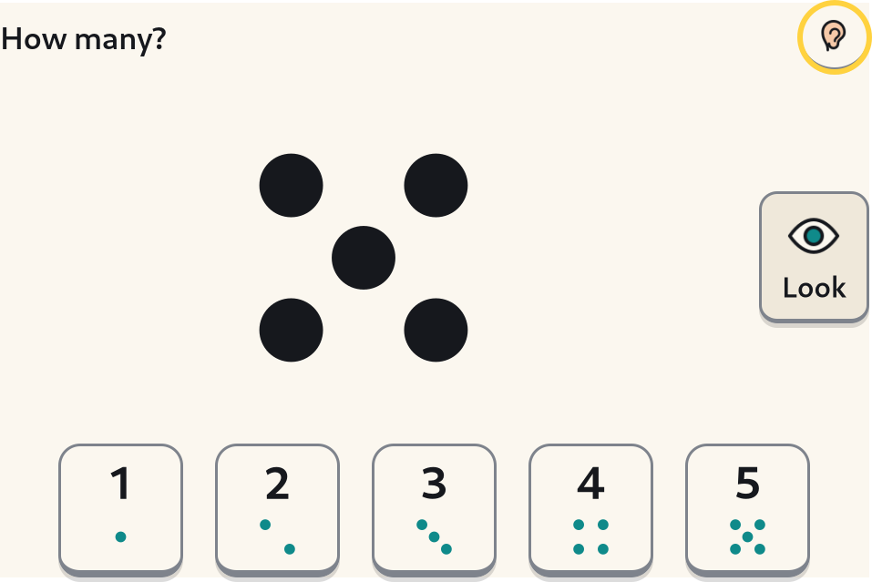
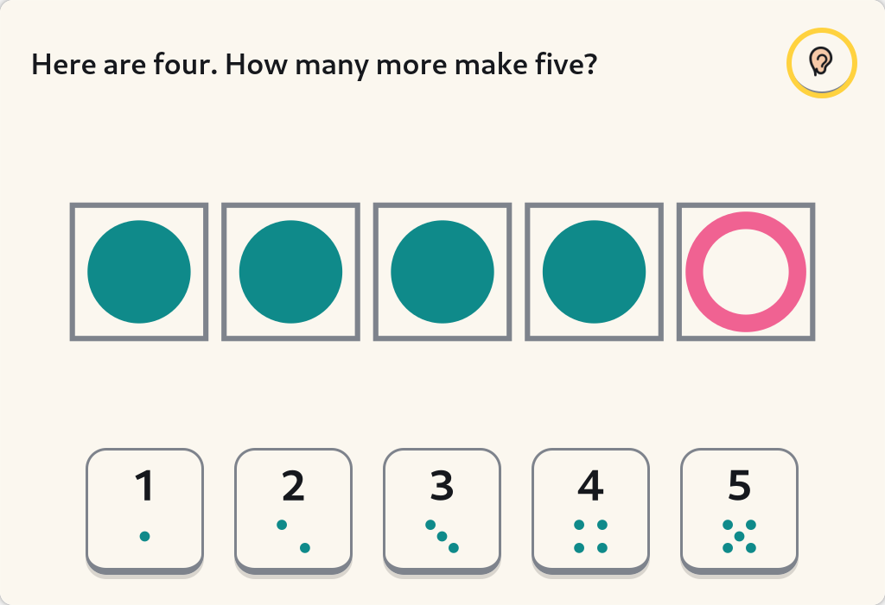

# Numbers — subitising and number bonds, built to the ELG

> Implementer's design note, 2026-08-23. `docs/plan/SUITE.md` §1 lists
> **Numbers** as P1: "subitising & bonds to 5/10 built to the ELG (05 §3)".
> This is the v1 of that: one predictable loop of eight items, about eight
> minutes, in `activities/numbers/`. Everything described here is implemented
> and tested unless a sentence says otherwise; §10 says what is not.

## 1. The one paragraph this is built to

The [EYFS Number ELG](https://www.gov.uk/government/publications/early-years-foundation-stage-framework--2)
`[CURR]` is unusually concrete, and unusually easy to design against:

> have a deep understanding of number to 10, including the composition of each
> number; **subitise (recognise quantities without counting) up to 5**;
> automatically recall (without reference to rhymes, counting or other aids)
> **number bonds up to 5** (including subtraction facts) **and some number
> bonds to 10, including double facts**.

The 2021 reform dropped shape, space and measure and *added* subitising.
`docs/research/05-learning-science.md` §2c notes that this is "a target almost
no consumer app addresses", and §3's list of missing activities names it
second: *"a subitising / number-bonds activity built to the actual ELG"*.

Two things follow, and they are the whole scope of v1:

1. **How many?** — subitise to five, and see six-to-ten as five-and-some-more.
2. **Make five, make ten** — the composition of five, and some of ten.

Nothing else. No counting games, no ordering, no comparison, no addition
sentences, no number line. Those are all real early-maths content and none of
them is what the ELG's two hard clauses ask for; a v1 that did six things badly
would be exactly the "100 undifferentiated activities" 05 §4 #11 warns about,
one shelf down.

## 2. What the evidence forbids, and what this activity does about it

`05` §2c is unusually rich in **negative** findings, and each one has a
corresponding decision here.

| Finding | What it rules out | What we do |
|---|---|---|
| Symbolic comparison predicts maths (r = .30) better than non-symbolic (r = .24); [Szűcs & Myers](https://doi.org/10.1016/j.tine.2016.11.002) find no conclusive evidence ANS training transfers; [Szkudlarek et al.](https://doi.org/10.1016/j.cognition.2020.104521) failed to replicate (RCT, N = 318) | **Dot-cloud / approximate-number training.** Ten random dots asking "roughly how many?" | Every quantity above four is a **canonical** arrangement. Random scatter exists only for 1–4, where a *perceptual* judgement is still possible. The numeral is on the answer tile at full size, because the symbol is the half that predicts anything. |
| [Kaminski & Sloutsky 2013](https://eric.ed.gov/?id=EJ1007940): countable pictures made 6–8s count the pictures and miss the structure — "extraneous perceptual information substantially attenuated learning". [Carbonneau et al.](https://doi.org/10.1037/a0031084) (META, 55 studies) find the same moderator | **Cartoon counters.** Five cupcakes, five dinosaurs, five anything | Plain discs on plain paper, in the shell's own two colours. There is not one decorative mark in `draw.py` and the module docstring says so. |
| [Steenbergen-Hu & Cooper](https://doi.org/10.1037/a0032447) (META, 34 samples): adaptive tutoring g = 0.01–0.09, **smaller** for low achievers. 05 §4 #8 | **A difficulty ladder.** Levels, unlocking, auto-advance | The loop is **fixed**: the same eight items in the same order every time. The range (to five / to ten) is a line in a root-owned file a grown-up writes, because it is a claim about what a *school* has taught. |
| [Kluger & DeNisi](https://doi.org/10.1037/0033-2909.119.2.254) (META, 607 ES): d = .41 overall but **more than a third of feedback interventions made performance worse** — the harmful ones pointing at the self rather than the task. SYNTHESIS E1 | **Scores, stars, streaks, "well done"** | Feedback is one of three things: the number said back ("Yes, four"), the method (the picture returns and the dots are counted), or the answer. `tests/test_words.py` checks every sentence the activity can produce against a ban list, and the same check runs over the window module's own literals. |
| [Outhwaite et al. 2023](https://repec-cepeo.ucl.ac.uk/cepeow/cepeowp23-02.pdf) (SR, 50 studies, 77 apps): 92% report positive effects, 2 of 5 delayed post-tests show fade-out at 1–2 months | Claiming this teaches maths | The manifest's goal line is *"Seeing how many without counting (up to 5), and which two numbers make 5. Goes up to 10 only when a grown-up raises the range. **Practice, not a test.**"* (tightened 2026-08-23: the old line promised 10 while the default range is five). |
| EEF onebillion (RCT, 113 schools): pupils did better where the supervising adult **saw their role as teaching**. GraphoGame: g = −0.02 alone, **0.48** with high adult interaction | A solo game | Every loop ends with a `GrownUpTurn` card asking the adult to do the same thing with fingers, away from the screen. |

And one positive finding that shapes the order of everything: the WWC's
[*Teaching Math to Young Children*](https://ies.ed.gov/ncee/wwc/PracticeGuide/18)
rates exactly **one** of its five recommendations at Moderate — *teach number
and operations following a developmental progression*. So: small before large,
canonical before varied, five before ten, and the double always among the tens.

## 3. The loop

Eight items, roughly eight minutes, always in this order:

```
  4 x  How many?          1-5 canonical, then 1-4 varied
                          (at the ten range: small, large, small, large)
  4 x  Make five/ten      at the five range: all four bonds to five
                          at the ten range: two to five, then five-and-five
                                            and one more to ten
  1 x  Your turn, grown-up
```

Predictable on purpose. The DfE's early-years guidance — the one the EYFS
framework now references — asks for content that is "slow-paced, repetitive and
predictable", and a four-year-old who knows what is coming next can spend their
attention on the number instead of on the program.

**The screen never changes shape.** One prompt at the top, one picture in the
middle, one row of numerals along the bottom. The numeral row is built once and
outlives every item (SYNTHESIS B1): a child who has learnt where the four is
should not have to search for it eight times in eight minutes.

Session length is **not ours**. The shell owns the clock, the ending offer and
the goodbye (activity SDK §11), and this activity never mentions time.

### 3.1 How many?

A picture appears for **1.6 seconds** (2.6 in calm mode) and goes. The child
presses a numeral tile, or the matching digit key.

* 1–5 are **dice faces** — the arrangement a child has already met on a dice, a
  domino and their own fingers.
* 6–10 are **ten-frames**, always a full top row and some more, which is
  *conceptual* subitising and is the representation the ELG's "composition of
  each number" is really about.
* The **last two** items of the four may be **scattered**, and only if they are
  four or fewer. A child who can only recognise the dice five has learnt a
  picture, not a number — but scattering five is a counting task wearing a
  subitising costume, and `arrange.py` will not do it.

**A "Look" button beside the picture** shows it again, as often as the child
likes, free and unrecorded. Making another look cost something is what turns a
practice into a test.

**A wrong answer is never called wrong.** The picture comes back and the dots
are revealed one at a time while the voice counts them — *"One, two, three,
four. Four."* — and the child has another go. On the second wrong answer they
are counted again and the child is simply told: *"There are four."* Two goes
and then being told is the shape of a grown-up sitting next to you; a third ask
is a test. Guidance beats discovery hardest for the youngest (d ≈ 0.5–0.7,
05 §2f), and 05 §4 #9 says in as many words not to design for struggle at five.

> The reveal is one utterance and many frames. The SDK's voice is a single
> speech-dispatcher connection where a new line cancels the old one, so
> counting dot-by-dot *in speech* would produce four cut-off syllables. The
> voice says the whole count; the picture is the half that happens one at a
> time.

### 3.2 Make five, make ten

A five- or ten-frame with some counters already in it: *"Here are three. How
many more make five?"* Two routes to the same answer, both press-only:

* **Fill the empty boxes.** Each empty box is its own 20 mm target. A counter
  goes **where the finger went** (the frame keeps a set of box indices, not a
  count), and a counter the child placed can be pressed again to take it back —
  the one place in the activity where a slip is possible, and therefore the one
  place that needs to be recoverable (SYNTHESIS C1).
* **Press the number that is missing.**

Either way the frame fills and the voice says the sentence: **"Three and two
make five."** *Make*, not *equals* and not *is*: the ELG's word for this is
composition, and five-year-olds meet it as two amounts put together long before
they meet an equals sign.

The counters that were already there are **solid discs**; the ones the child
put in are **rings**. Colour is never the sole carrier (B6 — ~8% of boys are
colour-blind, mostly undiagnosed), so the difference survives greyscale and a
photocopy.

Both parts of every bond are at least one. "Five and zero make five" is true
and is not what a five-year-old is learning, and an empty frame under "how many
more make five?" is a counting question in a bond's clothes.

### 3.3 Your turn, grown-up

The `GrownUpTurn` card at the end of the loop, in the SDK's adult typography,
not modal, not blocking, only its title read aloud:

> Show four fingers and ask how many — quickly, before they can count. Then
> hide a couple behind your back and ask how many more would make five. Fingers
> beat a screen for this, and doing it away from the computer is what makes it
> stick.

The numbers on it are taken from what the child has just done, so the adult's
question is the machine's question a minute later, with a person attached.

Beside it, a **"Some more"** button. Pressed, never automatic: D6 forbids
autoplay and up-next, and the system has no interest in whether the child goes
again.

## 4. The words

Everything the activity says is in `numbers_activity/words.py`, in one place,
so that what it says can be read. Two invariants, both tested over the entire
domain of numbers:

* **No digit ever reaches the ear.** The voice says "four"; the tile prints
  "4". `numeral()` is the only function allowed to produce a digit.
* **Nothing that could be read as a score, a mark or a verdict.** The ban list
  in `tests/test_words.py` covers points, stars, badges, streaks, levels,
  "well done", "correct", "wrong" and "out of", and is checked against every
  sentence the module can produce *and* against the `speak_text=` and label
  literals in `activity.py`, read out of the syntax tree so that a docstring
  explaining why there is no score does not trip a test looking for the word.

> **On "no digits where a child can see or hear them"** (SDK §12, from 01 #19).
> That rule is about digits as **chrome** — "twelve minutes left", "4/8", a
> counter of anything. It is not a rule against numerals as **content**, and in
> an activity built to an ELG about the composition of number to ten it could
> not be: the symbol meeting the quantity is the lesson. So the numeral is on
> the tile, at full size, in Andika — and it is in no sentence anywhere, which
> is the half of the rule that still binds.

## 5. What a grown-up sets

`/etc/kidnix/numbers.toml`, root-owned, with `/usr/share/kidnix/numbers.toml`
as the image's default (bootc's three-way merge makes `/etc` theirs and
`/usr/share` ours). The child owns `$XDG_CONFIG_HOME`, and a range a child can
edit is not a statement about what their school has taught.

| Key | Values | Default | What it means |
|---|---|---|---|
| `range` | `"five"`, `"ten"` | `"five"` | Five is the ELG's floor: subitise to 5, bonds to 5. Ten adds six-to-ten as five-and-some-more, and some bonds to ten including the double. |
| `numerals` | `true`, `false` | `true` | Print the digit on the answer tiles. `false` leaves the dot pattern alone, for a child who does not know the numerals yet. The spoken words are unchanged either way. |
| `frames` | `"auto"`, `"five"`, `"ten"` | `"auto"` | Auto gives a five-frame for the bonds to five and a ten-frame for the bonds to ten. `"ten"` uses the ten-frame throughout, with the boxes past the number greyed and not pressable — many UK schools do this so that five reads as half of ten. |

**Nothing in this file can stop the activity opening.** A missing file, a
malformed one, a typo in a key: all come back as the defaults with a line in
the log, and a good `range` beside a nonsense `frames` keeps the range. A
five-year-old told the computer is broken because a grown-up mistyped a TOML
key has been failed twice.

The one correction made without being asked: `frames = "five"` with a bond to
ten still gets a ten-frame, because ten counters do not fit in five boxes.

## 6. Input

All of it comes from the SDK, which is the point of the SDK.

* Every control is a `ChildButton` underneath: **press**, every mouse button,
  150 ms debounce, no double-click, no right-click, no long-press, no drag.
  There is no code path in this activity that could add one.
* Every target is at least **20 mm of real panel** (ADR-0011), computed from
  `ContentArea`, not from pixels. The numeral row tries 36/30/24/20 mm and
  wraps onto a second line rather than going under the floor.
* **The keyboard is never required, and takes exactly one thing** from the
  SDK's focus ring: the digits `1`–`9` and `0` (which means ten, because there
  is no zero to answer and the key is where a hand already is). Tab, the
  arrows, Enter and Space still walk and press every control. **Escape is not
  ours** — Back is a band button, one screen up, in the shell's own window, and
  an activity that handled Escape would have invented a second way out that is
  invisible, unlabelled and unspoken (SDK §3.4). A test asserts it by name.
* A digit key for a number this session does not offer says the number aloud
  rather than doing nothing: a press that produces silence is a press a child
  cannot learn from (A3, C4).
* **Calm mode** comes from the same root-owned `parent.toml` the shell reads,
  and lengthens the flash as well as removing motion.

## 7. What goes in the Journal

At the end of the loop (and again on the way out, for anything done since), one
`save_entry("picture", …)`:

* **the card** — today's bonds, drawn in the same frames the child was just
  looking at, solid counters and rings, with the sentence under each;
* **the caption** — *"Today: three and two make five"*, plus ", and two more"
  where there were more;
* **`meta`** — the bonds, the quantities, the range and the frame style.

There is **no outcome anywhere in that entry**. It records that
three-and-two-make-five was practised today; it does not record whether the
child said two straight away, said four first, or was told. A parent opening My
Things sees what their child worked on, which is a conversation. A parent
seeing "4/8" sees a mark, which is a different object with different effects on
a household, and kidnix does not make one. `Practised` has two fields and a
test asserts there are only two.

Nothing is kept if nothing was answered: a card for a session in which nobody
pressed anything would be a claim about a person that is not true. The
screenshot run keeps nothing either, for the same reason.

## 8. The shape of the package

```
activities/numbers/
    manifest.toml            id "numbers", quit = "signal", the goal line
    numbers.toml             the image's default parent settings
    numbers_activity/
        arrange.py           where the dots go            -- pure
        items.py             what is asked, in what order -- pure
        words.py             everything that is said      -- pure
        keys.py              what a key press meant       -- pure
        settings.py          what a grown-up chose        -- pure
        draw.py              the pictures                 -- cairo, no GTK
        activity.py          the window                   -- GTK
        screenshots.py       --screenshot
        icon.svg, look.svg, activity.css
    tests/                   164 test functions, ~800 cases
    Justfile                 setup / test / test-gtk / lint / validate / run /
                             screenshots / ci
```

**Importing the package imports no GTK.** Everything the activity knows is in
the pure modules and is tested headless; `draw.py` imports cairo, which is also
displayless, so even the pictures are exercised without a window. That is the
SDK's floor: *GTK tests may skip; logic tests may not.*

The GTK smoke tests build the real window under **Broadway** and never on a
developer's desktop (`just test-gtk`, AGENTS.md, SDK §10). So do the two
screenshots in `docs/design/screenshots/`:





## 9. Getting it onto the image (not done yet)

Deliberately not installed. `manifest.toml` is **not** in
`system_files/usr/share/kidnix/activities/`, so there is no tile, which is
correct: a tile that opens a half-built activity is worse than no tile. When it
goes on, it is the same three moves Sounds & Words and Clock will take:

1. `build_files/60-shell.sh` (or a `62-activities.sh` beside it) `cp -a`s
   `numbers_activity/` into `/usr/lib/kidnix/` and installs the console script
   as `/usr/bin/kidnix-numbers`, exactly as the SDK ships beside the shell —
   no PyPI, no venv, no wheel of its own (SDK §10);
2. `numbers.toml` → `/usr/share/kidnix/numbers.toml`, root-owned, `0644`;
3. `manifest.toml` → `/usr/share/kidnix/activities/numbers.toml`, and the icon
   path in it (`/usr/lib/kidnix/numbers_activity/icon.svg`) becomes true.

`just validate` runs the image build's own validator against the manifest
today, and `tests/test_manifest.py` runs it again in CI, so the file that lands
is one the shell has already accepted.

## 10. What is not built, and what we do not know

1. **Subtraction facts.** The ELG says "number bonds up to 5 **(including
   subtraction facts)**". Five and two make... is the same fact read the other
   way, and the frame is already the right picture for it (take counters out
   rather than put them in). It is a v2 item and it is the most obviously
   missing half of the ELG paragraph.
2. **The flash duration has no evidence behind it.** 1.6 seconds is a
   reasonable reading of the quick-images routine a Reception teacher uses, and
   nothing more. It is a candidate for the child-test protocol: too long and it
   is a counting task, too short and it is a startle.
3. **Nothing is spaced or scheduled.** Sounds & Words is getting a Leitner
   schedule; this activity picks a fresh session each time and remembers
   nothing between them. Spacing and retrieval are among the better-evidenced
   general findings (05 §2f) and a bond a child was told about yesterday is
   exactly the sort of thing worth bringing back. It needs somewhere to keep
   state that is not a score, which is a design question, not a coding one.
4. **No printable companion.** 05 §3's third missing activity is printable
   unplugged companions, and a page of ten-frames to fill in with a pencil is
   the obvious one here (physicality g = 0.72 vs 0.44; unplugged g = 1.03).
   The Journal card is already a printable artefact; a blank version is not.
5. **`smallnumbers` overlaps.** GCompris's `smallnumbers` is on the curated
   shelf for exactly this ELG clause (`system_files/usr/share/kidnix/gcompris/CURATION.md`).
   It is a falling die with a timer. This activity is the version with
   canonical arrangements, ten-frames, bonds, no timer and no score; when a
   child has both, we should watch which one they use and be willing to drop
   ours from the shelf if the answer is embarrassing.
6. **No child has used it.** Every claim in §3 about what a five-year-old will
   do is an inference from the literature. `docs/plan/CHILD-TEST-PROTOCOL.md`
   is where that gets fixed.
