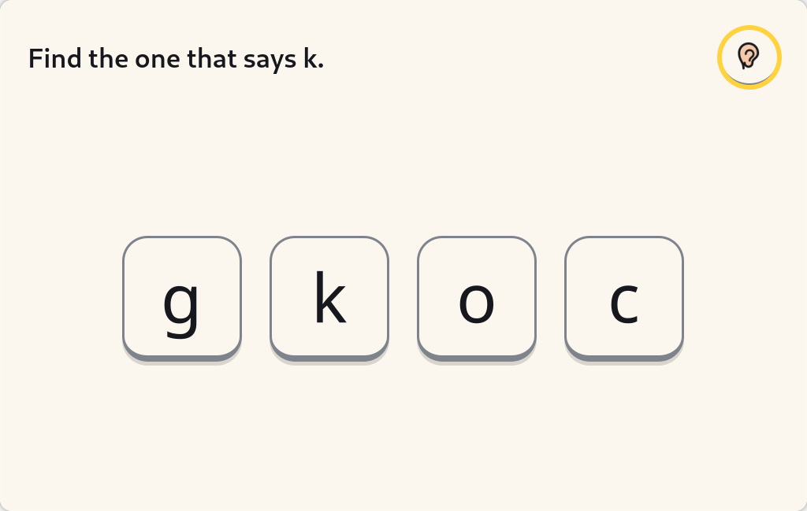
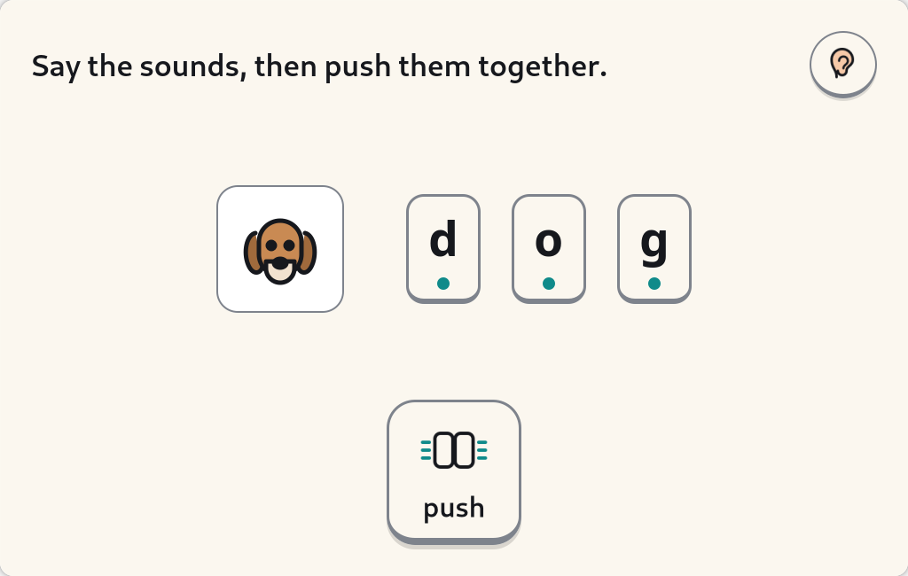
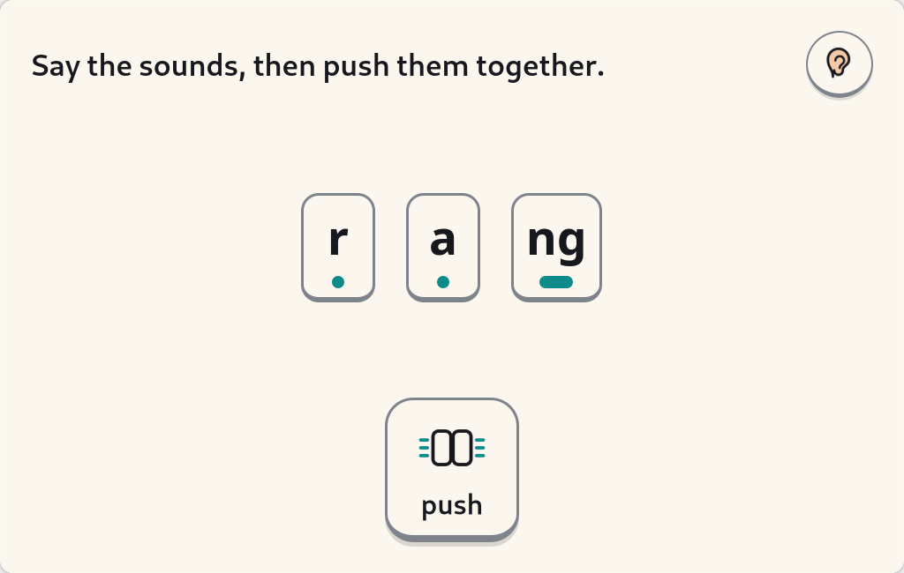

# Sounds & Words — design

> Implementer's design note, 2026-08-23, **weeks 1–3** of the six-week v1 in
> `docs/plan/SUITE.md` §3 and `docs/research/10-early-reading-writing-sota.md`
> §7.1. §§1–8 are week 1 — the corpus, the ceiling, the acceptance test, the
> schedule skeleton and the parent copy, none of which is GTK. **§12 is weeks
> 2–3**: the session loop, Find it, Blend it, the Journal card and the two
> screens as they actually look. §13 is how it gets onto the image, which has
> not happened yet.
>
> Code: `activities/sounds_and_words/`.

---

## 0. What this activity is, and what it must never claim

Sounds & Words practises the grapheme–phoneme correspondences (GPCs) and words a
child's school has **already** taught. That is the whole claim. It is not a
reading programme, it does not teach reading, it does not teach handwriting, and
it does not assess anybody.

The evidence behind that restraint is in research 10 §2–§3 and 05 §2a. The two
findings that shape every decision below:

- **The adult is the active ingredient.** McTigue et al.'s meta-analysis of
  digital phonics: g = −0.02 overall, **0.48** with high adult interaction. So
  this is a co-use tool with a grown-up turn in every loop, not a solo game.
- **Adaptivity buys nothing here.** The Norwegian GraphoGame RCT, whose only
  between-arm difference was adaptivity, found no difference. Spacing is Tier 1.
  So the model is a Leitner box and a `WHERE` clause, and the engineering goes
  into the corpus and the gate.

The design constitution item this activity exists to honour, from research 05
§2a: *"kidnix must not invent its own phonics progression, and must never show a
child a word containing a GPC they may not have been taught."*

---

## 1. One loop, not seven games

Research 10 §4.1: **A → G is one 8–12 minute loop, in that order, never a menu
of seven games.**

| | Module | Interaction | v1? |
|---|---|---|---|
| A | **Hear it** | a phoneme plays; the child picks which of three pictures starts with it. No letters on screen. | week 6 if time |
| B | **Find it** | "find the one that says /s/" — tap it, or press the key. Lowercase always. A digraph is a two-key sequence that visually fuses into one tile. | ✅ week 2 |
| C | **Blend it** | a decodable word with sound buttons — a dot under a single-letter grapheme, a **bar under a digraph or trigraph** (the L&S p.70 convention). Tap each; then a "push together" arrow merges them. Then the child says it aloud to a person. | ✅ week 3 |
| E | **Read it** | a 4–8 sentence decodable text, one sentence per screen, illustrated. Optional narration with word-by-word highlighting. **Zero hotspots, zero mini-games, zero tap-a-word dictionary.** | week 4 |
| D | Spell it | phoneme frame + tiles; any phonically-plausible answer celebrated | deferred |
| C+ | Try the other one | set-for-variability on a curated list | deferred |
| F | Write it | type it, record it, or ask a grown-up | deferred — belongs with letters-to-family |
| G | My name | the child's own name first | deferred — belongs with story-maker |

The **grown-up turn** is part of the loop, not a settings screen. Its copy lives
in `data/parent_text.toml` under `[grown_up_turn]`, with the reason attached:
*"The single clearest finding about phonics software is that it works when an
adult is involved and barely works when they are not. This screen is not
decoration."*

Week 1 builds none of these. It builds the thing all of them read from.

---

## 2. The corpus

### 2.1 Where it comes from

**Letters and Sounds (2007), DFES-00281-2007, © Crown copyright 2007, Open
Government Licence v3.0.** It is the only complete, openly-licensed English SSP
progression with published word banks. It is **not** on the DfE's validated
list, and kidnix must never describe it as a validated programme. It is used as
a *default ordering and a licensed word corpus*.

Attribution, carried at the top of every generated file and in
`activities/sounds_and_words/LICENSES.md`:

> Contains public sector information licensed under the Open Government Licence
> v3.0. <https://www.nationalarchives.gov.uk/doc/open-government-licence/version/3/>

Pages transcribed: 50, 69–71, 76–77, 99–103, 114, 125–128, 132–133, 151–154,
197–198. Every one is listed with what came from it in `data/sources.toml`.

The **DfE Reading Framework (2023)**, Appendix 7 (pp. 144–145), also OGL v3, is
transcribed verbatim as the acceptance-test fixture.

### 2.2 Schema

```
data/graphemes.toml     [[gpc]]          114 GPCs, in teaching order
                        [[untaught]]     15 pseudo-GPCs, never in any ceiling
data/words.toml         [[word]]         846 words, each with its GPC split
data/tricky_words.toml  [[tricky_word]]  56, gated by GPC order or by phase
data/sentences.toml     [[sentence]]     119 captions / questions / sentences
                        [[text]]         5 short connected texts (25 lines)
data/lexicon.toml       [[entry]]        200 segmentations for non-bank words
data/parent_text.toml                    every word a parent reads
data/sources.toml                        provenance, licence, additions, audit
data/schemes/                            the L&S order; stubs for the rest
```

A **GPC** is a grapheme *and* a phoneme, with a stable id:

```toml
[[gpc]]
id = "oo_short"          # unique; "oo" appears twice, with two phonemes
grapheme = "oo"
order = 41               # the global teaching index the ceiling gates on
phase = 3
ipa = "ʊ"
spoken_label = "oo (short, as in book)"
stretchable = false      # continuant? -- drives the Blend it slider later
kind = "digraph"         # single | digraph | trigraph | doubled | split_digraph
example_words = ["book", "look", "good"]
source = "ls2007:p.76, p.102"
variant_of = "oo"
```

`spoken_label` is written for a grown-up to *say*, and every one is checked
against a blacklist of schwa spellings — "suh" instead of "sss" is the classic
phonics error, and it is the reason narration must never synthesise a phoneme
(Piper reliably adds the schwa; the a–z clips come from GCompris and the ~20
digraph clips have to be recorded).

A **word** carries its segmentation, not just its spelling:

```toml
[[word]]
text = "rabbit"
phase = 2
order = 18                                   # max order over its GPCs
graphemes = ["r", "a", "bb", "i", "t"]
groups = ["sets 1-5 (+b)"]
source = "ls2007:p.70"
set = 5
```

Everything child-facing is lowercase. Captions and sentences are stored twice —
`text` exactly as printed (so the transcription can be checked against the PDF)
and `text_lower` for display.

### 2.3 What kidnix added, and why

All marked `added_by = "kidnix"` and explained in `data/sources.toml`.

1. **Eight doubled-consonant GPCs** — `bb dd gg mm nn pp rr tt`, at order 16.
   L&S teaches `ff ll ss` explicitly and says (p.70) that a doubled letter
   "represents one phoneme", but never introduces the others — while using them
   freely in its own banks from set 4: *rocket, carrot, ticket, pocket, rabbit,
   sitting, letter, ladder, supper*. Without them those words segment into the
   wrong number of phonemes, which would put the wrong number of sound buttons
   under them in Blend it.
2. **One GPC, `or_er`** — `or` standing for /ɜː/, as in *word, worm, work*.
   Section 3.2 explains why the acceptance test cannot work without it.
3. **Fifteen never-taught pseudo-GPCs** — `e_silent`, `le`, `ed_t`, `ei`,
   `ere_er`, `ough`, `augh`, … They are in no ceiling at any phase. They exist
   so the corpus can say *why* a word is not decodable rather than merely that
   it isn't. A test asserts every one of them is actually referenced by
   something; an unused pseudo-GPC is a typo.

### 2.4 What was left out

Four words from the L&S banks are not shipped, each with its reason in
`data/sources.toml`: **ass** and **god** (not words this machine offers a
five-year-old unprompted), **queue** (not analysable as a decodable string),
**whistle** and **scene** (need `le` and a silent `c`, so they could never pass
any ceiling and would sit in the bank unusable).

### 2.5 Running L&S back through its own gate

Filtering every transcribed caption and sentence at the phase it is printed in
found six that fail, and two of the five connected texts. They are not
transcription errors — they are in the document:

| Where | Word | Why |
|---|---|---|
| p.71, "Captions with sets 1–3 words" | *hat* | `h` is a **set 5** letter |
| p.101, p.103, p.128 (×3) | *into* | its final `o` stands for /uː/, a Phase 5 alternative |
| p.101, with the consonant digraphs | *are* | not taught until week 10 of Phase 3 |
| p.128, Phase 4 question | *by* | `y` for /aɪ/ is Phase 5 |
| p.103, "In town" | *may* | `ay` is a Phase 5 grapheme |
| p.69, set 3 (+k) column | *Ken* | the `e` it needs is a set 4 letter |

kidnix rejects those at those phases. That is the correct behaviour and the
point of having a filter. The list is pinned in
`tests/test_letters_and_sounds_audit.py` so it cannot drift: longer means
something broke, **shorter means something was quietly over-permitted**, which
is worse. Words like *Ken* are kept, flagged `order_exceeds_group`, and gate on
their true order rather than their printed column.

### 2.6 The corpus is generated

`tools/lsdata.py` is the transcription, page by page and column by column;
`tools/lexicon_data.py` is the hand-written segmentation for words longest-match
would get wrong; `tools/gen.py` joins them and writes `data/`.
`tests/test_generator.py` re-runs the generator into a temp directory and
insists the result is byte-identical to what is checked in, which is what makes
the "do not edit by hand" header true.

---

## 3. The ceiling

### 3.1 Two ideas, deliberately kept apart

- **The ceiling** = what the parent said the school has taught. A hard gate.
  Never inferred, never advanced because the child got good at something.
- **The schedule** = which of the *already-permitted* GPCs get rehearsed today.

`compose_session()` takes a `Ceiling` and can only choose from what it already
allows. Nothing in `schedule.py` can widen it, and a test asserts that across
eleven ceilings and six simulated days.

```python
ceiling = ceiling_for_grapheme(corpus, "ck")   # what the parent told us
check_text(corpus, "a cat in a hat", ceiling).report()
# "rejected: 'hat' needs h, which is not taught yet"
```

Three constructors: `ceiling_for_grapheme` (the parent's answer),
`ceiling_for_phase` (whole phases; Phase 4 adds no GPCs, only tricky words), and
`custom_ceiling` (an explicit GPC set — what the Reading Framework fixture
states). `intersect()` combines two conservatively.

A bare grapheme resolves to its **first** teaching, never a later alternative
pronunciation. "Up to `oo`" means `oo_long`, not `oo_short`. Under-permitting is
harmless; over-permitting undermines the school.

### 3.2 Why a lexicon and not just a segmenter

Longest-match segmentation over the taught graphemes is necessary and not
sufficient, because a grapheme can stand for a phoneme that has not been taught.
The Reading Framework's own example turns on exactly this:

```
worn   = w + or(/ɔː/) + n        decodable at Phase 3
worms  = w + or(/ɜː/) + m + s    NOT decodable at Phase 3
```

Both segment cleanly into the same taught graphemes. Only the pronunciation
separates them. *their* is the same trap: `th + e + i + r` is four taught
graphemes and a wrong answer. So:

1. the corpus stores a **GPC-id** segmentation for every word it ships, and that
   mapping is authoritative;
2. `segment()` — longest-match, longest-first so `night` is `n-igh-t` and not
   `n-i-g-h-t` — is the fallback;
3. in **strict mode, the default, an unknown word is rejected**, not guessed at.
   `catnap` segments perfectly at Phase 3 and is still refused, because guessing
   is how an untaught GPC reaches a child.

Split digraphs (`a-e`) are discontinuous and cannot be found by longest match at
all; `segment()` skips them and such words must come from the corpus.

### 3.3 Refusals name their cause

`WordVerdict.reason` is one of `OK_DECODABLE`, `OK_TRICKY`, `UNTAUGHT_GPC`,
`TRICKY_NOT_TAUGHT`, `UNKNOWN_WORD`, `NO_SEGMENTATION`, and `.explanation`
renders it in English. This is for us, not the child — the child is never told a
word was withheld, because a child who never sees the word has nothing to be
told about.

### 3.4 Tricky words

Gated by the GPC order L&S pins them to where it does (`to`/`the` after set 4;
`no`/`go`/`I` after set 5; `he`/`she` after set 7; `we`/`me`/`be` after `ng`;
`was` after `oa`; `my`/`you` after `oi`; `her`/`they`/`all`/`are` after `er`),
and by phase where it does not (Phases 4 and 5).

---

## 4. Co-existing with school

Research 10 §4.5, implemented in `schemes.py`.

The first-run parent questions, asked once and re-asked monthly: *"Which phonics
programme does the school use?"* and *"What is the most recent sound they have
taught?"* — a grapheme grid, not phase jargon, because parents know "he brought
home 'ai' this week".

kidnix ships **one** full ordering, Letters and Sounds. The rest are **stubs**:
named in `data/schemes/other_schemes.toml`, status recorded, with no ordering
claimed. A stub resolves to the L&S prefix, is marked `conservative`, and the
parent pane says so in plain words:

> We do not have this programme's own order of sounds, so we are using the
> Letters and Sounds order. That may hold back a sound the school has already
> taught. **It will never go ahead of them.**

That last sentence is asserted by a test against every stub's note and against
the parent copy, so the two cannot drift.

When a scheme's own order is added, `resolve_ceiling` switches automatically to
the **conservative intersection** — only the GPCs *both* orderings have taught by
that point. Tests cover this with a synthetic divergent scheme: a school that
teaches `sh` early and `p` late gets `{s, a, t, sh}`, dropping `p` even though
L&S teaches it in set 1.

Filling in a real scheme's order is a **licensing** decision per scheme, not a
coding one, and needs a row in `LICENSES.md` first. The conservative fallback
means we do not need that decision to ship. What we do not know — research 10
open question 6 — is what the under-permitting costs in boredom. The test suite
at least makes the number computable.

"I don't know" starts at Phase 2 set 1 and nudges the parent to ask the teacher.
Starting too low costs nothing; a five-year-old re-reading *sat, pat, tap* is not
harmed.

---

## 5. The acceptance test

Research 10 §4.2: *"If kidnix's generator produces the latter for that phase, it
is broken."*

The Reading Framework's Appendix 7 states a Reception child who knows every
letter of the alphabet plus `ck sh th ng ee oo or ar` and the exception words
`to, the, we` **cannot** read Book 1 (*What do they like to eat?*) or Book 2
(*Splash!*), and **can** read Book 3 (*A Trip to a Planet*) and Book 4 (*Shark
Facts*). All four are transcribed verbatim into
`tests/fixtures/reading_framework_appendix7.toml` with their expectation.

Books 1 and 2 are rejected. Books 3 and 4 are accepted, word by word. Beyond
that, individual tests pin the mechanisms:

- *worn* passes and *worms* is blocked on `or_er` — the pair the whole thing
  rests on;
- *puddle* segments cleanly under longest match and is still blocked, on `le`;
- *their* segments cleanly and is blocked as a tricky word above the ceiling —
  the other of the two mechanisms;
- *he* is refused and *we* allowed, because the framework named three exception
  words and *he* is not one of them.

**One honest wrinkle, recorded in the fixture rather than buried.** The
framework's grapheme list names no doubled consonants, but its own Book 3
contains *off* and *will* and Book 4 contains *dropping* and *getting*. The
fixture ceiling therefore adds `ff ll ss zz` and the kidnix doublets, and the
two L&S footnote variants (`s`→/z/, `f`→/v/), with the reason written next to
them. A test proves the addition is load-bearing: without it, *off* fails. An
acceptance test that quietly widens its own ceiling is not an acceptance test.

---

## 6. The schedule

Research 10 §4.3. Deliberately dumb, inspectable, deterministic; it lives in one
file in the child's home and a parent can read it in a text editor.

**Leitner box 0–5, intervals `0, 1, 2, 4, 8, 16` days.** Correct first attempt
promotes. Any error demotes to **box 1, never to 0** — a demotion to zero
re-teaches, and re-teaching is the school's job.

**Mastered** = box ≥ 4 **and** three consecutive first-attempt correct **across
at least two different days**. The two-day rule is the whole point: it stops
same-session repetition faking mastery, which is the standard failure of in-app
mastery bars. Six correct answers in one sitting is not mastery, and a test says
so.

**Session composition**, fixed and boring: 60% due for review, 20% newest
permitted GPC, 20% oldest mastered (interleaving). If nothing is due the session
is shorter — **kidnix does not manufacture work**, and there is a test for the
empty session.

`compose_session(corpus, ceiling, history, day) -> Session` returns a list of
`Item`s — Find it for each selected GPC, then Blend it words for each, then one
Read it. Data only: no widgets, no audio, no timing. Deterministic for a given
day, so the same child opening it twice gets the same plan.

Every session always lands in real language — one caption or sentence at least,
never a pure isolated-grapheme drill loop, because research 05 §2a's honest
reading of the phonics debate is *phonics **and** meaning, from the start*.

**Instrumentation, never scoring.** `GpcState` records attempts, first-attempt
correct, boxes and dates. `parent_state()` collapses all of it to exactly three
strings — *not tried* / *tried* / *read correctly on 3 different days* — and
those three strings are asserted equal to the ones in `parent_text.toml`.

---

## 7. Honesty, enforced by tests

Research 10 §4.4. **To the child: nothing numeric, ever.** No score, star,
percentage, streak or level. What he sees at the end is the thing he made.

**To the parent: three panes and no scores.**

1. *What the school has taught* — the parent's own statement, editable, framed
   as theirs and not ours.
2. *What we've seen him read here* — the three-state grid, plus, verbatim:
   > This is what happened on this computer. It is not an assessment, and it is
   > not a substitute for what his teacher sees. Children read differently for a
   > machine than for a person.
3. *What he made* — recordings, spellings, captions, with dates. The pane that
   recruits the parent into the loop.

`tests/test_parent_text.py` greps every string in `parent_text.toml` for a
blacklist: *percentile, reading age, score, grade, rank, average, %, star,
streak, badge, coin, leaderboard, level, screening check, ahead of other,
compared to other, amber, red flag, teaches your child to read*. One section is
exempt — `what_this_is_not`, whose job is to name those things and refuse them —
and separate tests check it actually does.

The **"what this is not"** page is five paragraphs, each with its own test:
not a reading programme; not handwriting (pencil, paper, and we do not teach
letter formation); the school decides the next sound; not an assessment (if
you're worried, talk to his teacher); never grades reading aloud; no rewards.

Nothing here is decoration. These are exactly the rules that get lost the first
time somebody adds a progress bar "just for the parent", so they are tests.

---

## 8. What is not built, on purpose

From research 10 §4.6, so it stays said:

1. No invented progression, and no untaught GPC in a decodable context.
2. **No hotspots, tap-to-animate, embedded mini-games or tap-a-word dictionary
   in Read it.** The clearest negative finding in the whole literature.
3. No reward economy: no stars, streaks, badges, leaderboards, coins, pets or
   unlockables. GraphoGame Rime was rated "highly engaging" and produced −1
   month.
4. Letter *names* are taught, in a labelled mode, later — but never used inside
   blending or segmenting.
5. No pseudo-word drills for the screening check. A few of L&S's own "silly
   names" (*ip, ug, ock*) inside blending is fine; a test is not.
6. **No ASR judging oral reading. Ever.** Record-and-keep is the safe design.
7. No auto-correct, spell-check or red squiggle in any child-facing field.
8. No claim to teach reading or to raise screening-check scores.
9. No handwriting, letter formation, cursive or lead-in strokes — and we say so
   to parents on the same screen that introduces the keyboard.
10. No multisensory claims. Actions and mnemonics ship as *pleasant*, never as
    *proven*.
11. No unmodified US content. US GPC orders, /æ/ in "bath" and rhotic vowels
    break a UK progression.
12. No gating on time or streaks. A weekend away costs nothing.

Also deliberately not built: **homework mode**. We do not import the school's
weekly word list and we do not claim to be the school's app.

---

## 9. Weeks 2–6

Week 1 is data and pure logic — no GTK, no audio, no window — so that the part
that carries the guarantee is provable headless. The UI sits on
`shell/kidnix_activity` (the SDK; its contract doc is
`docs/design/activity-sdk.md`, being written alongside). What that means in
practice:

- **A manifest** (`id = "sounds-and-words"`, `quit = "signal"`, an honest `goal`
  line, `journal_watch` for Read it and Blend it artefacts).
- `ActivityApplication` + `ActivityWindow` for the full-screen surface below the
  band; `ContentArea` for mm sizing; `BigButton`/`PictureTile` for the Find it
  grid; `GrownUpTurn` for the grown-up turn, which is a first-class SDK widget
  and not something this activity invents.
- `speech.py` for narration and the caption hook — **sentences only**. Isolated
  phonemes come from recorded audio (GCompris a–z, CC-BY-SA-4.0, already in the
  image) plus ~20 digraph clips that still have to be recorded. Never synthesise
  a phoneme.
- `journal.save_entry()` for "the words I read today" and any recording.
- `lifecycle`: SIGTERM → save → exit. No quit dialogue.

| Week | Deliverable |
|---|---|
| 1 | ✅ corpus, ceiling, Appendix 7 acceptance test, schedule skeleton, parent copy |
| 2 | ✅ **Find it** — screen and keyboard, lowercase (§12.3). The ~20 digraph clips are **still not recorded** (§12.6) |
| 3 | ✅ **Blend it** — sound buttons with the dot/bar convention, the push-together arrow, the Journal card (§12.4–§12.5) |
| 4 | **Read it** — ~12 authored decodable texts, Phases 2–3, Piper narration, optional word highlighting, no interactive elements |
| 5 | the three-pane parent view, wired to `History` and `parent_text.toml` |
| 6 | **Hear it** if time, accessibility pass, image tests, the "what this is not" page |

Left for later, on purpose: Spell it, set-for-variability, Write it, My name,
dialogic prompts, the printable unplugged pack, and any second scheme's native
ordering. Write it and My name belong with story-maker and letters-to-family and
should be built once, there, not twice.

---

## 10. Evaluation, and what would falsify this

Research 10 §7.2. n = 1 gives usability and harm-absence, not efficacy, and the
write-up must say so. The only design with causal purchase is a **within-child
multiple baseline across GPC sets**: pick three sets the school has taught but
kidnix has not yet scheduled; probe all three weekly (parent-administered, 60
seconds, "say the sound for each of these"); introduce them into the schedule
staggered a fortnight apart. If the probe curve bends when — and only when —
kidnix starts scheduling a set, that is real, if fragile, evidence.

**Falsifiers, stated in advance:**

- he cannot find a key from a sound without help by session 5;
- the sound buttons produce sound-by-sound reading that never merges;
- he taps through Read it to the end without reading;
- **he stops returning within two weeks** — the sharpest one.

The behavioural observations that matter more than any log: does he read a
sentence aloud to someone unprompted? Does he ask a grown-up what a word says?
Does he go and find a paper book afterwards? No telemetry can capture those, and
`docs/plan/CHILD-TEST-PROTOCOL.md` is how they get recorded.

---

## 11. Licensing summary

| Asset | Licence | Status |
|---|---|---|
| Letters and Sounds (2007), DFES-00281-2007 | **OGL v3.0**, © Crown copyright 2007 | verified, transcribed, attributed |
| DfE Reading Framework (2023), Appendix 7 | **OGL v3.0**, © Crown copyright | verified, transcribed verbatim as a fixture |
| NC English Appendix 1 (Spelling) | **OGL v3.0** | cited; transcription is a v1.1 job |
| kidnix's additions and all code | Apache-2.0 | ours |
| a–z phoneme audio (GCompris `voices-en_GB`) | CC-BY-SA-4.0 | already in the image |
| ~20 digraph/trigraph clips | ours, CC-BY-SA-4.0 | **not recorded yet** — and neither are the a–z ones, in usable form (§12.6) |
| 18 drawings (15 word pictures, 3 interface icons) | ours, Apache-2.0 | drawn 2026-08-23; hand-written SVG paths, no traced artwork |
| narration (Piper `en_GB-cori-high`) | public domain | pinned; sentences only |
| ~12 decodable texts | ours, Apache-2.0 | week 4 |

Full ledger with the exact OGL attribution:
`activities/sounds_and_words/LICENSES.md`. Machine-readable half:
`data/sources.toml`. Per AGENTS.md §5, anything new gets a row in both, in the
same commit as the download.

**Residual risk, recorded rather than ignored.** L&S credits its word and
high-frequency-word tables (p. 195) to Masterson, Stuart, Dixon & Lovejoy (2003),
*Children's Printed Word Database*, ESRC R00023406. The tables as published are
inside an OGL document and are redistributed on that basis; a cautious reading
treats the *derived frequency ranking* as third-party. kidnix ships no frequency
data and needs none — L&S's lists are already matched to the progression, which
is the thing that matters.

---

## 12. Weeks 2–3: the loop, on a screen

Everything in §§1–8 was data and pure logic. This section is the part a child
can press. It sits on `kidnix_activity` (the SDK; `docs/design/activity-sdk.md`),
which means the input rules, the millimetres, the voice, the captions, calm mode
and the SIGTERM save all arrive already correct and are not re-derived here.

**The split from §9 is kept exactly.** `sounds_and_words/` still imports no GTK
except in `activity.py` and `screenshots.py`; `import sounds_and_words` pulls in
no `gi`, and a test asserts that in a subprocess. The guarantee this activity
carries — *never show a child a grapheme the school has not taught* — lives in
the half that can be proved without a display.

```
sounds_and_words/
  settings.py     the parent's ceiling (/etc) and this child's history (§12.2)
  loop.py         the session: order, twelve items, twelve minutes, two tries
  distractors.py  which three wrong tiles, and why those three (§12.3)
  keys.py         what a key press meant, digraphs included (§12.3)
  blend.py        dots, bars, and the three stages of a word (§12.4)
  phonemes.py     what to *say* for a sound, and where it comes from (§12.6)
  pictures.py     fifteen concrete nouns, drawn here
  summary.py      the card the child takes away (§12.5)
  activity.py     the window. Wiring only.
  screenshots.py  --screenshot, under Broadway, never on a desktop
```

### 12.1 The session, and the two bounds it will not cross

`loop.plan_session()` calls `schedule.compose_session()` and then cuts what
comes back down to something a five-year-old can finish:

```
start → (Hear it: not built) → Find it → Blend it → (Read it: week 4) → done
```

**Twelve items** and **twelve minutes**, both asserted. Four Find it items and
eight Blend it words is exactly twelve, which is how the two numbers were chosen
rather than the other way round; the trim always cuts from the end, so the
module order survives it. If the schedule has less to do the session is shorter
— kidnix does not manufacture work — and a ceiling of "nothing taught yet" gives
an empty session rather than an invented one.

The runnable part of a full session costs ~8 minutes today; the whole loop with
Read it in it lands at ~9.7, inside research 10 §4.1's 8–12 band. A test pins
both numbers so that adding Read it cannot quietly push the session past twelve.

**Missing modules are skipped, not stubbed.** There is no greyed-out "coming
soon" tile for Hear it or Read it. A child would press it every single session
and be refused every single time, which is the opposite of what an activity
promising predictability should ship. The Read it items the schedule plans are
kept in `Plan.deferred` so the start-up log can say what week 4 will add.

### 12.2 Where the ceiling and the history live

| | |
|---|---|
| the ceiling | `/etc/kidnix/sounds_and_words.toml`, `[ceiling] scheme`, `last_grapheme`; falls back to `/usr/share/kidnix/sounds_and_words.toml` |
| the history | `$XDG_STATE_HOME/kidnix/profiles/<KIDNIX_PROFILE_ID>/sounds-and-words/history.json` |

Root-owned config, in the same place and under the same ownership rule as the
shell's `parent.toml`: the child owns `$XDG_CONFIG_HOME`, and a child-writable
ceiling is not a ceiling. `/etc` first and `/usr/share` second because bootc's
three-way merge makes `/etc` the parent's copy and `/usr/share` ours.

**The dev default is Phase 2 set 3** — `s a t p i n m d g o c k`, twelve GPCs
and seventy-two words — and it is deliberately low. Research 10 §4.5: *starting
too low costs nothing; a five-year-old re-reading `sat, pat, tap` is not
harmed*, whereas a default that guessed high would show a child a sound the
school has not taught, which is the one thing this activity may never do. A
broken TOML file, an unknown scheme or an unknown grapheme all fall **back to
that default and say so in the log** — never up, and never a refusal to start,
because a grown-up's typo must not become "the computer is broken" to a child.

The history is per profile, because two siblings sharing one Leitner box means
neither one's spacing is real. It is indented JSON with the dates written out,
so §6's promise — *a parent can read the model in a text editor* — is true. A
corrupt file costs the spacing schedule (which rebuilds itself over a few
sessions and which the child cannot see) and is **left on disk** rather than
overwritten, so whoever debugs it still has it.

`settings.progress_dir()` computes that path without importing `kidnix_shell`,
so the pure half stays importable on a machine with no shell. That is a
duplicated spelling, so `tests/test_sdk.py` re-derives it from
`LaunchEnv.paths.profile_state` and fails if the two ever disagree.

### 12.3 Find it (module B)



The prompt speaks the phoneme and can replay it; four tiles carry the grapheme
in lowercase Andika at **40 mm**, and each one speaks *its own sound* on hover
and on focus — so a child sweeping the row hears the four sounds without having
to commit to one.

**Two routes to the same answer, neither privileged.** Tap the tile, or press
the key. Research 10 §6 is the framing that makes the keyboard legitimate at
five: *"press the key that makes /s/" is not typing practice, it is
find-the-grapheme-from-a-sound*, which is a stated Letters and Sounds Phase 2
success criterion. There is no home row, no finger assignment, no WPM and no
timer anywhere in `keys.py`.

- **Lowercase, and Shift is never required.** Input is folded, so a child with
  Caps Lock on is not told they are wrong.
- **A digraph is two keys that fuse into one tile.** `s` then `h` is `sh`, and
  the `s` on the way there is *pending*, never a wrong answer — the failure
  research 10 §6 warns about by name.
- **A key that is not on the board is not a mistake.** It replays the sound and
  costs nothing. A five-year-old exploring a keyboard presses things.
- **No timer for the ambiguous case.** When `a` and `ai` are both on the board,
  `a` is held: the next key resolves it, or the widget layer settles it after a
  pause. A timeout inside the pure model would make the fastest child wrong.

**Right:** the tile glows, the voice says *"yes, sss"* — the sound named, not
the child praised (research 05 §2f: informational, never controlling) — and the
loop moves on. **Wrong:** no buzzer, no red, no cross, and nothing at all
happens to the tile they pressed. The **correct** tile pulses gently and the
sound plays again. After two tries the loop moves on without comment. The
Leitner box is written from the **first** attempt only: getting it on the third
go is not the same event as getting it first time.

**Distractors are chosen, not sampled** (`distractors.py`), in four tiers:
reversals and rotations first (`b`/`d`, `p`/`q`, `n`/`u`, `m`/`w`), then
visually similar (`m`/`n`, `c`/`o`, `i`/`l`, `s`/`z`), then multigraphs sharing
a letter in the same position (`sh` against `ch` and `th`), then nearest in
teaching order. Two rules underneath, both tested against every taught GPC:

1. **Never an untaught grapheme.** A distractor is still a grapheme kidnix put
   on a screen, and the constitution has no exception for wrong answers. A tiny
   ceiling gives a board of three tiles, or of one — never a fourth borrowed
   from next term.
2. **Never two tiles with the same spelling.** `oo` is in the corpus twice and
   so is `s`; both on one board is an unanswerable question that looks, to a
   child, exactly like being told they are wrong when they are right.

### 12.4 Blend it (module C)



A word from the ceiling-filtered corpus, one sound button per **sound** —
never per letter — with the Letters and Sounds p.70 marks under them: a **dot**
under a one-letter grapheme, a **bar** under a digraph, trigraph or doubled
consonant. Split digraphs have a third mark in the model and nothing in the v1
ceiling reaches them.



The bar is not decoration. It is the entire visual claim that `ng` is *one*
sound, and a child taught with bars who is shown two dots under `ng` has been
told the opposite of what their teacher told them. For the same reason a
grapheme label never wraps: `ng` broken across two lines as `n-` / `g` would be
showing two sounds where there is one.

Tapping a button says that phoneme and only that phoneme. The **push-together
arrow** slides the tiles together and says the whole word. It is a *button you
tap*, not a slider you drag — SYNTHESIS A5's click-move-click with the move
taken out — and it is **never a gate**: a child who already knows the word can
press it first, and one who wants to hear `c` eleven times can. Research 10 open
question 2 is whether sound buttons help or entrench sound-by-sound reading, and
an activity that *forced* every button before the word could be heard would have
answered that question the wrong way by construction.

Then it stops being software's job. The prompt becomes *"now say it out loud"*
and a `GrownUpTurn` card asks the adult to have the child read it to them.
kidnix never listens to a child read and never grades it (§8 #6). The card is
not modal, takes no focus and blocks nothing: an adult who has walked away must
not be able to strand a child.

**Pictures** are fifteen concrete nouns drawn here — bag, bed, bus, cat, cup,
dog, fox, hat, jam, map, net, pin, pot, sun, tap — and nothing else. A picture
beside `cat` is worth having and a picture beside `sat` is not; a vague scribble
next to a verb teaches a child to distrust the pictures next to the nouns. They
are flat and high-contrast so every one reads in greyscale (SYNTHESIS B6), they
contain no text, and they are ours under Apache-2.0 (`LICENSES.md` §4).

### 12.5 What the child takes away

At the end, `save_entry(kind="sounds", …)` writes one card into the child's
Journal: the words they read today, set in Andika, on cream, with the caption
*"Read today: cat, sat, pin"* and a `meta.json` carrying `gpcs_practised`,
`words`, `date` and the ceiling.

The card carries **the words and nothing else**. No count of them — "3 words
today" is a score with a friendly face on it — no tick, no date (01 #19: no
digits where a child can see them; the shell draws the day heading itself, for
the adult), and no "well done". A session where nothing was blended keeps no
card and says nothing about it. The done screen and the SIGTERM save cannot each
keep one: a second identical card in My Things is a bug the child would have to
live with.

### 12.6 The audio, stated honestly

**Every phoneme a child hears today is a placeholder.** `phonemes.py` resolves
a GPC to a recording if there is one at
`/usr/share/kidnix/sounds-and-words/phonemes/<gpc-id>.ogg`, and otherwise to the
corpus's kidnix-safe *spelled* label — "sss", "shh", "ay" — spoken by the
ordinary voice. Those spellings are the ones §2.2's schwa blacklist already
checks, they are good for `sss` and thin for `ck`, and `Source.SPELLED` marks
every one of them as what it is.

Two things stand between that and real recordings, and neither is in this
activity's hands:

1. **The a–z clips exist and are not readable.** GCompris's `voices-en_GB`
   bundle is in the image and `build_files/55-gcompris.sh` already asserts
   `alphabet/U0061.ogg`…`U007A.ogg` are in it — but it is a Qt `.rcc` archive,
   not loose files. Unpacking it once, at build time, into the directory above
   is a `build_files/` job and this activity does not own that directory.
2. **No digraph clip exists anywhere.** ~20 clips, one adult, one morning
   (research 10 §5 and open question 8), and they become kidnix's own
   CC-BY-SA-4.0 asset.

`phonemes.missing_recordings()` is the list that has to reach empty before this
section may stop saying "placeholder", and it is computed against what is
actually installed rather than asserted here. There is also no clip *player* in
the SDK yet, so the first real clip will fail as a missing player rather than as
a wrong sound.

### 12.7 What the tests cover

554 tests, all green, `ruff check` clean. 317 of them are new this pass: item
selection, the distractor tiers and the two rules under them, the keyboard
mapping including digraph sequences and the ambiguous-prefix case, session
composition and both bounds, the two-attempt rule, the first-attempt-only box
write, the card's caption and meta, the parent-ceiling fallbacks, and the fifteen
drawings. All of those are headless and none of them needs a display.

On top of that, 31 GTK tests build both screens for real — tile sizes in
millimetres, the spoken strings, the ring, the pulse landing on the *correct*
tile and not on the pressed one, the digraph key sequence, the dots and bars,
the push, the grown-up card, the whole loop end to end, and an assertion that no
digit appears on any screen. They skip where there is no display; the logic
tests never do. They are run under Broadway (`just test-gtk`) and never present
a window, so nothing opens on a developer's desktop.

The screenshots above are regenerated by `just screenshots`, also under
Broadway. `--ceiling` is a **development override** for exactly that purpose: it
logs a warning, the manifest's `exec` is the bare command, and a child's session
cannot reach it.

---

## 13. Getting it onto the image — not done yet

Nothing here is installed. `manifest.toml` is deliberately **not** in
`system_files/usr/share/kidnix/activities/`, so there is no tile, because a tile
that opens a half-built activity is worse than no tile. What a later image wave
has to do, in one commit:

1. **Ship the package.** `build_files/` copies `activities/sounds_and_words/
   sounds_and_words` into the same `purelib` that `60-shell.sh` copies
   `kidnix_shell` and `kidnix_activity` into, with `data/`, `pictures/`,
   `icons/` and `activity.css` beside it, and byte-compiles it with
   `--invalidation-mode unchecked-hash` like the shell. A plain `cp -a` for the
   same reason the shell uses one: hatchling and pip would have to be installed
   into the image and removed again to produce a byte-identical tree.
2. **Ship the console script.** `/usr/bin/kidnix-sounds-and-words`, which is
   what `exec` in the manifest names.
3. **Ship the manifest** as `/usr/share/kidnix/activities/sounds-and-words.toml`,
   and run `kidnix-activity validate` on it in the build, as the SDK asks.
4. **Ship a default ceiling** at `/usr/share/kidnix/sounds_and_words.toml` with
   the Phase 2 set 3 default written out and commented, so a parent editing
   `/etc/kidnix/sounds_and_words.toml` has something to copy — and so the
   fallback in §12.2 is a *documented* default rather than a constant in a
   Python file.
5. **A tile**, "Sounds & words", `category = "learn"`, `age_band = "4-6"`, with
   the goal line from the manifest verbatim: *"Practises the letter sounds the
   school has already taught. Not a reading programme."*
6. **An icon.** The manifest names `kidnix-learn`, which is the shell's own
   bundled category icon. A drawing of its own belongs in `docs/design/
   icons-brief.md` with the rest.
7. **An image test**, in the shape `tests/image/` already uses: the package
   imports under the image's Python, the manifest validates, the console script
   is on `PATH`, and `data/` is where `corpus.data_dir()` looks.
8. **One e2e step**, as the SDK asks of every activity: launch it, blend one
   word, find the card in My Things.

Two things that should land at the same time or the activity ships with a hole
in it: **the shell's caption listener** (`docs/design/activity-sdk.md` §4.2 —
until it exists the spoken prompt, which *is* the instruction here, is
audio-only, and B2 is unfixed for the whole time a child spends in this
activity); and **the phoneme clips** (§12.6).
