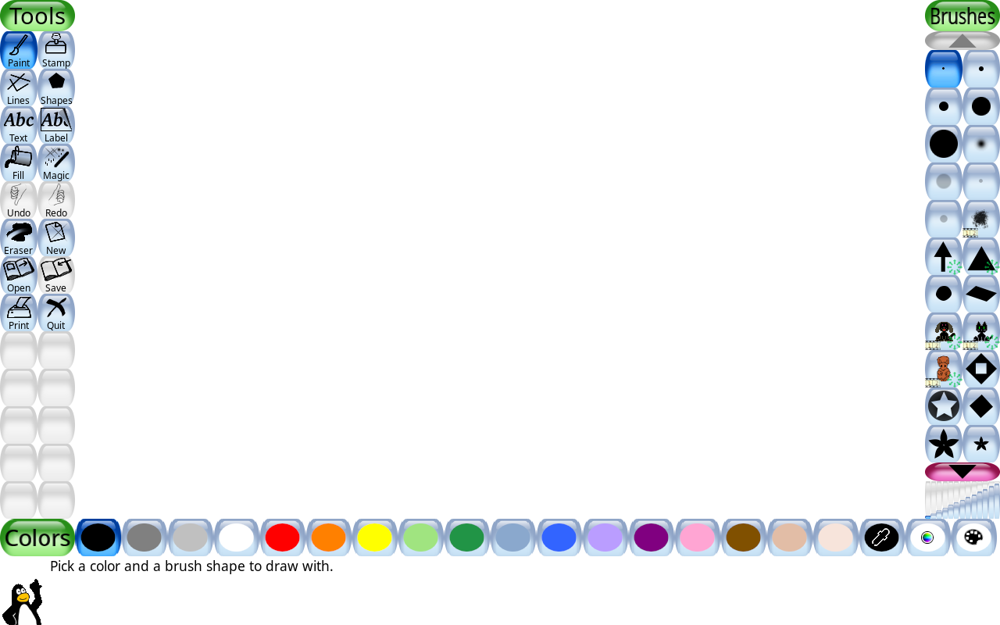
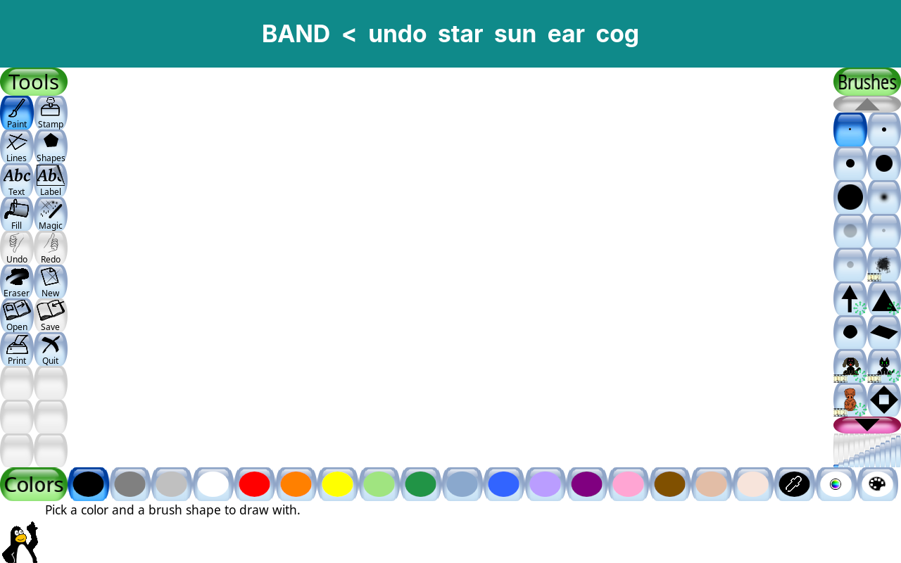

# Band over activity: keeping the shell's chrome on screen while an activity runs

> Implementer's spike, 2026-08-22. Closes `docs/design/shell-v0.1.md` §8's first
> bullet and `docs/research/07-linux-stack.md` §4 item 10 (the unverified
> `window-config.ini` schema). It is the compositor half of the audit's P0
> cluster — B3, C1, D3, 01 #15, #22, #30, 08 §3.2e, §4.6 all fail for the same
> reason (`docs/design/cci-compliance-audit-2026-08-22.md`).

**Result: solved, on the stack we already ship, with no new dependency and no
compositor of our own.** The band stays on screen for the whole of
`IN_ACTIVITY`, and the activity is *given the area below it* rather than being
covered up. Measured on the real image in a booted VM.

| Before | After |
|---|---|
|  |  |
| The band is gone. Tux Paint owns rows 0–799. | Band owns rows 0–95; Tux Paint owns 96–799 and has re-laid out into it — its own `Tools` and `Brushes` headers are intact, nothing is occluded, no letterboxing. |

Versions under test, from the image itself: `gnome-kiosk-50.1-1.fc44`,
`mutter-50.4-1.fc44`, `gtk4-4.22.4-1.fc44`, `tuxpaint-0.9.35-4.fc44`, panel
1280×800.

---

## 1. How to reproduce

```sh
python3 tests/spikes/band/run_spike.py --only 09-production
```

Throwaway harness (`tests/spikes/band/`, not part of `just ci`). It boots the
existing `output/qcow2/disk.qcow2` under QEMU in `-snapshot` mode — the disk is
never written — drives it over ssh and QMP, and writes screenshots plus the
compositor's own debug log to `output/spikes/band/`. **No image rebuild is
needed** for any of this: `window-config.ini` lives in the kid's home.

Experiments `00`–`09` are all in `run_spike.py`; `facts.py` answers the two
questions pixels cannot.

---

## 2. The schema, verified

`/usr/share/doc/gnome-kiosk/CONFIG.md` exists in our image and documents
`window-config.ini` in full. Research doc 07 flagged this as UNVERIFIED; it is
now read and exercised. Match keys: `match-title`, `match-class`,
`match-sandboxed-app-id`, `match-tag`. Set keys: `set-fullscreen`, `set-x`,
`set-y`, `set-width`, `set-height`, `set-above`, `set-on-monitor`,
`lock-on-monitor`, `lock-on-monitor-area`, `lock-on-area`, `set-window-type`.

Search path, first hit wins: `$XDG_CONFIG_HOME/gnome-kiosk/window-config.ini`,
then `$XDG_DATA_DIRS/gnome-kiosk/window-config.ini`. Every section is evaluated;
sections have no special names; for a given key the **last** matching section
wins. Patterns are `g_pattern_match_simple`, so `org.mozilla.*` works.

### Four rules the documentation does not tell you

These cost the spike most of its time and they determine the whole design.

**R1 — the config is resolved once, at compositor start, and the file monitor is
only armed if the *user* file already existed.** `kiosk_window_config_load()`
runs at construction; `setup_file_monitoring()` returns early when
`user_config_file_path` is `NULL`. A `window-config.ini` created *after*
gnome-kiosk is running is never seen, no matter how often it is rewritten. Three
runs of this spike produced flawless-looking null results before this was found.
Once the file exists at start-up, every subsequent write *is* picked up live
(`G_FILE_MONITOR_EVENT_CHANGED` → `kiosk_window_config_reload()`).

**R2 — geometry is only applied while a window is "initial", i.e. during its
first configure.** `set-x/-y/-width/-height`, `set-fullscreen` and `lock-on-area`
are consumed inside the `if (kiosk_window_config_is_initial(...))` branch of
`apply_initial_config()`, which is used up on the window's first configure. A
section that only starts matching later has its geometry keys read and
discarded — the debug log cheerfully prints `Using 'set-y=96'` while nothing
moves.

**R3 — and at that first configure a window's identity may not exist yet, which
is toolkit-dependent.** From the compositor's own log:

```
configure window: W1 (python3)
  Value 'org.kidnix.BandProto' matches key 'match-class=...' from section [band]
  Using 'set-x=0' … 'set-height=96'          <- GTK4: app_id already set, placed

configure window: W2 ([untitled])
  Value '' does not match key 'match-class=TuxPaint.TuxPaint'   <- SDL2: too late
  Should make window 'W2 ([untitled])' fullscreen by default
```

GTK4 sets `app_id` before its first configure, so `match-class` *can* place a
GTK window. SDL2 (Tux Paint) does not, so `match-class` *cannot* place it — the
auto-fullscreen heuristic wins first. **Only a catch-all section (no match keys)
is guaranteed to match early enough to place any window.** This is the single
most important finding here, and it is why the recommendation below never
matches an activity by name.

**R4 — `set-above` is exempt from R2, and is one-way.** It is applied on every
pass, outside the initial branch, so matching by title or class works for it.
gnome-kiosk only ever calls `meta_window_make_above()` and never
`unmake_above()`, so a later `set-above=false` cannot lower an already-raised
window. That is what makes the phased configuration below safe.

Incidentally, Tux Paint's `wm_class` is **`TuxPaint.TuxPaint`**, not `tuxpaint`.
Only the compositor's debug log will tell you that
(`G_MESSAGES_DEBUG=all` on `org.gnome.Kiosk@wayland.service`).

---

## 3. The options, ranked

### (a) `window-config.ini` — **RECOMMENDED, and it works today**

Both halves of the question are yes:

1. *Can it pin the shell to a fixed strip and keep it above?* Yes —
   `set-x/-y/-width/-height` place it, `set-above=true` keeps it above a
   fullscreen-sized activity. Verified: band at rows 0–95 in every frame of
   experiments 02, 06, 07, 08, 09, including after clicking into the activity.
2. *Can it constrain everything else to the area below?* Yes —
   `lock-on-area=0,96 1280x704` is a real mutter external constraint, not just an
   initial placement, and it is what stops an activity taking the screen back.
   Verified: Tux Paint at rows 96–799, `set-fullscreen=false` honoured.

The obstacle is R2/R3: one *static* file cannot express "the band at the top,
everything else below", because only a catch-all matches early enough to place a
window, there is no negation syntax, and the catch-all therefore drags the band
down too (experiments 03 and 05: the band landed at rows 96–191, overlapping the
activity).

**The fix is to sequence the catch-all in time rather than name windows.** The
shell writes the file; gnome-kiosk reloads on every write (R1); each window's
initial config is consumed once (R2), so a window keeps what it was given:

| Step | File says the catch-all is | Effect |
|---|---|---|
| shell starts | `0,0 1280x96` | the band window is created and placed in the strip |
| band is mapped | `0,96 1280x704` + `lock-on-area` | the shell's content window, and every activity after it, land below the band |

There is exactly **one** transition, at shell start-up — not one per activity
launch. `[band] match-title=kidnix band / set-above=true` is present in both
files and does the raising (R4).

Measured, experiment `09-production`, rendering the templates now sitting in
`system_files/usr/share/kidnix/kiosk/`:

```
09-production-1-band        band 0..95 | empty    96..799
09-production-2-home        band 0..95 | content  96..799
09-production-3-activity    band 0..95 | activity 96..799
09-production-4-after-click band 0..95 | activity 96..799   <- no re-fullscreen
09-production-5-back-home   band 0..95 | content  96..799   <- clean return
```

**What Tux Paint does when it cannot be fullscreen:** it simply re-lays out into
1280×704 and carries on. No letterboxing, no black bars, no complaint in its log,
`fullscreen=native` in `/etc/tuxpaint/tuxpaint.conf` notwithstanding. Its canvas
shrinks by the 96 px the band takes; every tool stays reachable. It does not try
to re-fullscreen on focus, and clicking into it does not disturb the band.

### (b) "above" hints and struts — no separate mechanism, and no shell concept

There is no `org.gnome.Kiosk` window/shell D-Bus API: the image ships **no**
`/usr/share/dbus-1/interfaces/org.gnome.Kiosk*.xml`, and `gnome-kiosk --help`
offers only `--wayland`, `--no-x11`, `--display-server`, `--headless`,
`--virtual-monitor`, `--devkit`, `--debug-control`, `--enable-vt-switch`,
`--force-animations`, `--no-cursor`. gnome-kiosk's D-Bus surface is keyboard
layouts, by design ("no persistent UI elements"). So "above" is reachable only
through `window-config.ini`, i.e. option (a).

`set-window-type=dock` is the mechanism the docs advertise for panels, and
empirically it *also* held the band on top (experiment 01). **Do not use it.**
mutter's `meta_window_get_default_layer()` drops a `META_WINDOW_DOCK` to
`META_LAYER_BOTTOM` whenever `window->monitor->in_fullscreen` — a documented
code path we happened not to hit, and one that would put the band *behind* the
activity the first time an activity really does own the monitor. `set-above`
takes the `wm_state_above` branch, which is tested first and has no fullscreen
condition. Prefer it.

Struts are moot: xdg-shell has no strut protocol. `_NET_WM_STRUT` exists only for
X11 clients under XWayland and cannot be set by a GTK4 Wayland shell — and it
would be the wrong tool anyway, since we need to constrain *other* apps, which
`lock-on-area` does directly.

`match-tag` is the mechanism upstream itself uses for gnome-kiosk's notification
windows, and it would be a cleaner, static answer than the phased file — it is
known at window creation, so it beats R3. **It is not available to us:** mutter
50.4 implements `xdg_toplevel_tag_v1`, but GTK 4.22.4 does not expose it (no
`xdg_toplevel_tag` symbol in `libgtk-4.so.1`). Worth revisiting when GTK gains
it; it would delete the phased rewrite entirely.

### (c) Nested compositor (cage / gamescope / wlroots) — unnecessary

Would work, and buys nothing option (a) does not already give us, at the cost of
a second compositor in the process tree, a second input path, another
screenshot/portal story, and doubled latency for every activity. It also breaks
the "activities are ordinary programs on an ordinary session" property that
AGENTS.md non-negotiable 7 rests on. `xdg-foreign` is for embedding *dialogs*
across processes, not for hosting an app's whole surface, and GTK4 has no
`GtkWaylandSurface`. Not recommended.

### (d) The shell becomes the compositor — note the cost only

A mutter-based or wlroots-based kidnix compositor would give total control
(true struts, input regions, per-activity scaling, a real lock). It is also a
multi-month commitment: session integration, portals, a11y bus, input methods,
keyboard layouts, VT handling, screen capture, and every regression GNOME
absorbs upstream would become ours. Option (a) costs about a day and takes out
seven audit findings. Revisit only if a requirement appears that
`window-config.ini` genuinely cannot express.

### (e) Interim global escape — **does not work; do not plan around it**

Tested directly and it fails. `gnome-settings-daemon`'s MediaKeys service *is*
running in the kid session (`org.gnome.SettingsDaemon.MediaKeys.service` is
`active`), the schema key `custom-keybindings` exists, and setting it is
accepted — but the compositor refuses the grab:

```
gsd-media-keys: Failed to grab accelerator for keybinding
  custom:/org/gnome/settings-daemon/plugins/media-keys/custom-keybindings/kidnix0/
```

Three chords tried (`<Super><Shift>Escape`, `<Control><Alt>k`, `<Super>k`); none
fired. gnome-kiosk implements very few keybindings and does not honour gsd's
custom ones. Since (a) works, this is moot — but it is worth recording that the
fallback everyone reaches for is not available.

---

## 4. Recommendation

Adopt (a) with the phased catch-all. Prototype files are in
`system_files/usr/share/kidnix/kiosk/` (`README.md`, `window-config.band.ini`,
`window-config.activity.ini`, `window-config.seed.ini`) — templates with
`@WIDTH@` / `@HEIGHT@` / `@BAND_HEIGHT@` / `@CONTENT_HEIGHT@` tokens, none of
them wired into the image yet.

### What the shell has to change: two window roles

Today the shell is **one fullscreen window** that draws the band and the current
surface together (`app.py:103 ShellWindow`, `app.py:182 self.fullscreen()`), and
`IN_ACTIVITY` simply leaves it behind the activity (`launcher.py` docstring).
That has to become **two toplevels on one `GtkApplication`** — one process, one
app id, distinguished by title, because two processes sharing a `GtkApplication`
id do not get two windows (the second just re-activates the first; the spike hit
this and had to be rewritten).

| Role | Title | Geometry | Contents | Lifetime |
|---|---|---|---|---|
| **band** | `kidnix band` | `0,0 W×H_band`, above | Back, Undo, My Things, sun, Ear, Grown-up | created first, never destroyed, never hidden |
| **content** | `kidnix content` | `0,H_band W×(H−H_band)` | Who's here, Home, Journal, Ending, Goodbye, Sleeping | created after the band; hidden behind the activity during `IN_ACTIVITY` |

Sequence at start-up:

1. measure the monitor (`Gdk.Display.get_monitors()` — no window needed) and
   compute `H_band` as `metrics.py` already does (96 px nominal, clamped 80–128);
2. render `window-config.band.ini` → `~/.config/gnome-kiosk/window-config.ini`;
3. create and present the **band** window; wait for it to be mapped;
4. render `window-config.activity.ini` over the same path;
5. create and present the **content** window.

Then never touch the file again. Launching and quitting activities needs no
compositor interaction at all — `launcher.py` is unchanged.

Other consequences, all of them things the audit already asked for:

- `_present_ending_offer()` (`app.py:446`) stops being a fullscreen modal over
  the child's drawing. Offer it **in the band** first and only take the content
  area if it is ignored (audit 02 #4).
- The autosave keep-earcon and its animation (`app.py:527 _on_new_work`) become
  visible, because the band is on screen (audit 01 #20).
- Undo, the Ear and the sun are reachable throughout a session (01 #15, #22, #30,
  08 §3.2e, §4.6).
- Tux Paint's own Quit tool can finally be hidden, because the band's Back is
  always there — which removes the unreadable "Do you really want to quit?"
  modal (audit 01 #24, currently a blocked P0).
- The content window is no longer fullscreen, so
  `_check_measured_fit` (`app.py:274`) must lay out against `H − H_band`, not the
  monitor height.

### Session/image change (one line, plus a file)

`window-config.ini` must exist **before** gnome-kiosk starts (R1).
`/usr/bin/kidnix-shell` already writes into `$HOME/.config` before `exec`ing
`gnome-session`, so:

```sh
install -D -m 0644 /usr/share/kidnix/kiosk/window-config.seed.ini \
    "${HOME}/.config/gnome-kiosk/window-config.ini"
```

The seed's numbers do not matter — the shell overwrites it with measured ones
within a second. Only its existence matters.

### Effort

| Piece | Estimate |
|---|---|
| Split `ShellWindow` into band + content toplevels; move the surfaces | 1 day |
| Render the templates, sequence the two writes, wait for map | 0.5 day |
| Seed line in `kidnix-shell` + image test asserting the seed lands | 0.5 day |
| Ending offer in the band; relayout for `H − H_band` | 0.5 day |
| e2e assertions (band rows present in every `IN_ACTIVITY` frame) | 0.5 day |

**≈ 3 days**, against seven P0/P1 audit findings.

---

## 5. Open questions

1. **Multi-monitor.** Everything here is single-monitor and uses absolute
   `lock-on-area`. `set-on-monitor` + `lock-on-monitor-area` are the multi-head
   equivalents and are untested. Not urgent — the target hardware is one panel.
2. **Tux Paint's toolkit.** It has `WAYLAND_DISPLAY` and no `DISPLAY` when the
   spike launches it, yet reports an X11-shaped `wm_class` (`TuxPaint.TuxPaint`)
   and maps `libX11`. The shell's `ENV_ALLOWLIST` (`launcher.py`) passes
   `DISPLAY` through when it is set, so a shell-launched Tux Paint may land on
   XWayland instead and present a *different* `wm_class`. The recommendation is
   immune (the catch-all matches on nothing), but anything that ever matches an
   activity by class must confirm this first.
3. **Race on the second write.** Step 4→5 above assumes gnome-kiosk's
   `GFileMonitor` has reloaded before the content window is created. The spike
   used a 3 s sleep. Production wants something better — wait for the band's
   `map` signal plus a short settle, and assert the content window's final size
   in the shell's own log so a regression is visible.
4. **Shell restart mid-activity.** `Restart=always` means a crashed shell
   re-runs the start-up sequence while an activity is on screen; the band would
   briefly re-place under the phase-A file. Untested. Likely harmless (the
   activity's initial config is long consumed) but it should be exercised.
5. `--headless --virtual-monitor WxH` on `gnome-kiosk` is a cheaper CI rig than
   booting a qcow2, if the band assertions ever need to run per-PR.
