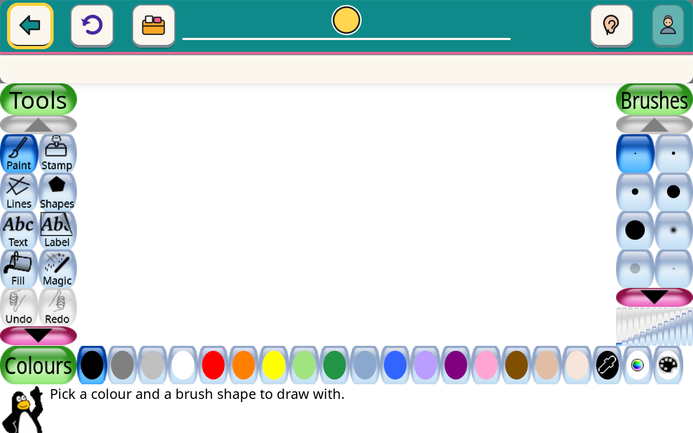
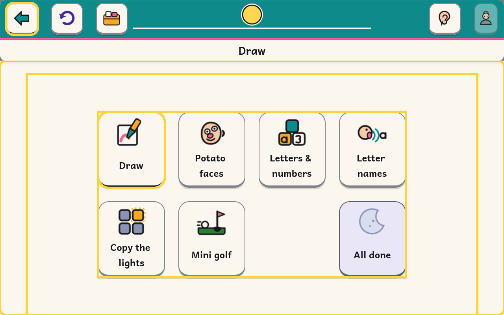

# Leaving an activity without a pointer: one keybinding, measured

> Implementer's spike, 2026-08-23. Closes the A25 finding in
> `docs/design/FLOWS.md` and the one in
> `tests/e2e/test_flows.py::test_a25_a_whole_session_on_the_keyboard`:
>
> > *inside an activity the compositor gives the keyboard to the activity's
> > toplevel, so Escape never reaches the shell's Back … **leaving an activity
> > is the one step of a session a switch user cannot take**.*

**Result: solved with one dconf key.** `org.gnome.desktop.wm.keybindings
switch-applications = ['<Super>Tab']`, locked, with the other 101 keybindings
still blank. gnome-kiosk lets mutter's own handler run for that key; it moves
the keyboard from the activity to a window of the shell's, where Escape *is*
Back. Measured end to end in a booted VM, in a real kid session, with Tux Paint
launched by the shell:

```
after <Super>Tab   speaking: Draw                       <- the shell has the keyboard
after Escape       the band asked the activity to finish (back)
                   asking tuxpaint to quit (SIGTERM, quit=confirm, ask 1)
```

Versions under test, from the image: `gnome-kiosk-50.1-1.fc44`,
`mutter-50.4-1.fc44`, `gtk4-4.22.4-1.fc44`, `tuxpaint-0.9.35-4.fc44`, panel
1280×800.

**One thing it costs, and it is not free** — §4: mutter *activates* the next
window, and activation raises. The shell window it lands on today is the
content window, so the child's drawing is covered while they answer. A one-line
change in the shell fixes it; that change is not in this commit.

---

## 1. How to reproduce

No image rebuild is needed to re-run the experiment: the whole thing is a dconf
profile swap in `/etc`, which is writable.

```sh
# a private copy, so a concurrent build of output/qcow2 cannot collide
cp --reflink=auto output/qcow2/disk.qcow2 /var/tmp/kb.qcow2
```

In the guest, as root:

```sh
cp -a /usr/share/kidnix/dconf/kid.d /var/tmp/kt
sed -i "s|^switch-applications=@as \[\]$|switch-applications=['<Super>Tab']|" \
    /var/tmp/kt/50-keybindings
dconf compile /var/tmp/kid-test.compiled /var/tmp/kt
sed -i 's|/usr/share/kidnix/dconf/kid.compiled|/var/tmp/kid-test.compiled|' \
    /etc/dconf/profile/kid
systemctl reboot
```

Three traps, all of them cost time here:

1. **The profile is read once, at process start.** `dconf` has no reload for a
   `file-db`, and the *lock* list is read at compositor start too, so a
   `gsettings set` in the session cannot be used to try a value out. The
   session has to restart.
2. **`systemctl restart gdm` does not bring the kid session back** on this
   image (`NAutoVTs=0`, no VT to land on). Reboot instead. `tests/e2e/vm.py`
   passes `-no-reboot`, so a harness that reboots must drop that argument; the
   `-snapshot` overlay survives a guest reboot perfectly well.
3. **`gsettings get` without `DCONF_PROFILE=kid` reads the stock schema
   defaults**, which for these keys look plausibly like a result
   (`switch-applications` defaults to `['<Super>Tab', '<Alt>Tab']`). A whole
   run was misread that way. Always set the profile, or ask the compositor's
   own environment (`/proc/$(pidof gnome-kiosk)/environ`).

## 2. What gnome-kiosk honours, and why this key survives

gnome-kiosk is mutter, and it neutralises the keybindings it does not want by
installing its own no-op handlers (`meta_keybindings_set_custom_handler` is in
its imports). The names it takes over are in the binary:

```
$ grep -a -o -E '(switch|cycle|move|toggle|activate|panel|raise|set-spew)-[a-z0-9-]+' \
      /usr/bin/gnome-kiosk | sort -u
activate-window-menu  move-to-workspace-*  panel-main-menu  panel-run-dialog
set-spew-mark  switch-input-source  switch-monitor  switch-to-session-1..12
switch-to-workspace-*  toggle-above  toggle-on-all-workspaces  toggle-shaded
```

`switch-applications`, `switch-windows`, `cycle-windows` and `switch-group` are
**not** in that list, so for those four mutter's own `handle_switch` runs: it
takes the next window off the most-recently-used tab list and activates it.
Without gnome-shell there is no switcher popup, no overview and no launcher for
it to draw — the compositor simply moves the focus.

That is the whole mechanism. It is also the only one available:

* **gsd custom keybindings do not work.** `gnome-settings-daemon`'s MediaKeys
  plugin is running in the kid session and accepts `custom-keybindings`, but
  the compositor refuses the grab (`Failed to grab accelerator for keybinding
  custom:…`), for three different chords —
  `docs/spikes/band-over-activity.md` §3e.
* **`window-config.ini` cannot focus anything.** Its complete key set is
  `match-{title,class,sandboxed-app-id,tag}`,
  `set-{fullscreen,x,y,width,height,above,on-monitor,window-type}`,
  `lock-on-{area,monitor,monitor-area}`. The word *focus* does not appear in
  `/usr/share/doc/gnome-kiosk/CONFIG.md` at all (`grep -ci focus` → 0).
* **There is no gnome-kiosk D-Bus API** for windows or focus; it ships no
  `org.gnome.Kiosk*` interface XML and its D-Bus surface is keyboard layouts by
  design (band spike §3b).

## 3. The measurement

`-display none` throughout, QMP key injection, on the shipped qcow2 with the
profile swap above. Five candidates were enabled at once on distinct chords.

### 3a. With Tux Paint running, from a clean start

| Binding | Chord | bare Tab (control) | after the chord |
|---|---|---|---|
| `switch-applications` | `<Super>Tab` | shell silent | **shell speaks** — it has the keyboard |

The control matters: with the activity focused, a bare Tab produces nothing in
the shell's journal at all. That *is* the A25 finding, reproduced — the keys
are the activity's.

The other four candidates were measured in the same pass and their results are
**not trustworthy**, and are not claimed: once the first chord had moved the
focus, the "click back into the activity" reset did not restore it (§4 explains
why — the shell window is now *on top* of the activity, so the click landed on
the shell). Only the first candidate ran against a clean state. What can be
said is that one binding is enough, and that `switch-applications` is it.

### 3b. The real path, shell-launched Draw

Driven on key values alone: Enter on the child's face, Enter on the first plan,
Tab to `Draw`, Enter — then, from inside the drawing:

```
<Super>Tab   INFO kidnix_shell.speech: speaking: Draw
Escape       INFO kidnix_shell.app:      the band asked the activity to finish (back)
             INFO kidnix_shell.launcher: asking tuxpaint to quit (SIGTERM, quit=confirm, ask 1)
```

That is exactly the path the band's Back button takes when a pointer presses
it. Nothing in the shell had to change: the key controller is already on both
toplevels in the capture phase, so whichever window the compositor hands the
keyboard to, Escape arrives (`shell/kidnix_shell/keyboard.py`).

### 3c. Negative controls, same session

| Attempt | Result |
|---|---|
| `Ctrl+Alt+F2` | `fgconsole` 2 → 2; still one `kid` session on seat0. VT switching stays dead. |
| `Shift+Super+Tab` | nothing: `switch-applications-backward` is still blank. |
| The band's pixels across the chord | **0.00 % changed** — no switcher popup, no overview, nothing drawn. |

## 4. What it costs: activation raises

`meta_window_activate` focuses *and raises*. The shell has two toplevels
(band, content) and the one mutter picks is the shell's most-recently-used
window — which during an activity is the **content** window, because that is
what the child was looking at when they pressed Draw.

| Inside the drawing | After `<Super>Tab` |
|---|---|
|  |  |

Measured on those two frames: below the band, **91.3 % of the pixels changed**
and Tux Paint's green is gone; the band itself is byte-identical, and the ring
is on Back. Escape then works — but the child answers Tux Paint's "really
quit?" with their drawing hidden behind Home, and pressing the chord a second
time is what brings it back (the chord toggles between the two most recent
windows).

**The fix is one line, and it belongs to the shell, not here:** present the
*band* window immediately before spawning an activity, so the band — 96 px
tall, already `set-above`, and covering nothing — is the shell's most-recently-
used window when the chord is pressed. The activity still takes focus when it
maps, so nothing else changes. Not done in this commit because `shell/` is
another owner's; it is the natural companion and it is cheap.

Two smaller options were considered and are worse: hiding the content window
for the whole of `IN_ACTIVITY` (same effect, but it makes the ending offer and
the return from Back a re-show race), and making the content window a
`set-window-type=dock` so it drops out of the tab list (mutter puts docks
*below* a fullscreen window — the band spike rejected the same trick for the
band, and for the same reason it is unreviewable here).

## 5. What was rejected

* **Escape over the activity SDK / caption socket.** First-party activities
  could forward Escape to the shell as a Back request. It does not help the
  case that matters: Tux Paint, GCompris and every other third-party activity
  we ship know nothing about our socket, and A25 is about *any* activity. Worth
  having later for first-party polish; useless as the mechanism.
* **A global "escape hatch" chord via gsd.** Refused by the compositor, §2.
* **Our own compositor.** Months, for one keystroke (band spike §3d).

## 6. What ships, and what asserts it

`build_files/40-lockdown.sh` still generates the blanking keyfile from the live
schemas, then re-enables exactly one line of it and refuses to build if
anything else has a chord:

```ini
[org/gnome/desktop/wm/keybindings]
switch-applications=['<Super>Tab']
```

with `/org/gnome/desktop/wm/keybindings/switch-applications` in the generated
lock list, so nothing in the session can change or clear it. The build fails if
the key is not re-enabled, if it is not locked, if `switch-applications-
backward`, `switch-windows`, `cycle-windows`, `switch-group`, `switch-panels`,
`toggle-fullscreen` or `panel-run-dialog` stop being blank, or if more than one
binding in the whole file carries a chord.

`<Super>Tab` and not `<Alt>Tab`: one chord, and the one an adult or an
assistive-technology switch interface sends on purpose. Super is a modifier no
activity we ship uses, and one direction reaches every window of a two-window
shell.

| Layer | What it proves |
|---|---|
| `build_files/40-lockdown.sh` | the value is in the compiled database, reads back, and is locked — at build time |
| `tests/image/test_lockdown.sh` | the shipped image says the same, and exactly one binding has a chord |
| `tests/boot/bcvk_boot_test.py` | the setting survives into a **live session**, and the compositor acts on it with Tux Paint on the screen |
| `tests/e2e/test_flows.py` | §7 — the A25 flow can now leave an activity without a pointer |

Measured on the built image (`just tag=a25 build && just tag=a25 test-boot`,
65 checks, 0 failed):

```
PASS  the way out of an activity is bound in the live session:
      switch-applications = ['<Super>Tab']
PASS  ...and it is locked, so nothing in the session can clear it (writable 'false')
PASS  ...and nothing came with it: switch-applications-backward is still blank
PASS  three Enters from a synthetic keyboard reach IN_ACTIVITY with Tux Paint running
PASS  <Super>Tab then Escape, from inside the activity, is the shell's own Back
PASS  ...and the child is told what is happening ("is asking if you're done")
```

`just tag=a25 test-image lockdown` is 184 checks, 0 failed, with the new
keybinding assertions among them.

### The boot test can press keys after all

`bcvk` gives no QMP, and XTEST would be delivered by Xwayland to X11 clients
rather than to the compositor. A **synthetic `/dev/uinput` keyboard created
inside the guest** works: libinput picks it up like any other keyboard, and
mutter's keybindings fire. Verified before it was written into the test — three
Enters from a uinput device carried the shell from "Who's here?" to Home.

The probe creates the device, waits 2 s for udev and libinput to notice it,
presses, and destroys it; the checks are `a25_binding`, `a25_writable`,
`a25_backward`, `a25_in_activity`, `a25_back_asked`, `a25_asking_spoken`. If
`/dev/uinput` is absent the live half prints a NOTE and is not asserted — a gap
in the harness is not a fault in the image, and pretending otherwise is worse
than saying so.

Two things the first run of it taught, both now in the probe:

* **A synthetic keyboard can lose its first keystroke**, because the device can
  be created a moment before libinput is ready for it. Each Enter is therefore
  pressed until the screen it should have changed appears in the shell's
  journal, up to three times — a lost keystroke would otherwise desynchronise
  the whole sequence and look exactly like a broken keybinding.
* **"… is asking if you're done" arrives 30 seconds after Back**, not
  immediately: the shell waits the activity's own `quit_grace` before deciding
  that an activity which has not gone is asking a question
  (`app.py::_activity_is_asking`), and `tuxpaint.toml` sets `quit_grace = 30`.
  The probe reads that number out of the manifest and polls for the line rather
  than sleeping a guess. The first run failed exactly here, with Back logged
  and nothing spoken, which is what a three-second sleep buys you.

## 7. For the e2e (`tests/e2e/`, not this spike's to edit)

`test_a25_a_whole_session_on_the_keyboard` currently leaves the activity **by
pointer** and prints a FINDING saying that is the one step a switch user cannot
take. That is now false, and the replacement is two lines with the harness that
is already there:

```python
vm.key("meta_l", "tab")   # <Super>Tab: the keyboard comes back to the shell
vm.key("esc")             # ...where Escape is the shell's own Back
story.expect_log("the band asked the activity to finish", since=cursor, timeout=25)
```

QEMU qcodes: `meta_l` is Super, `spc` is Space, and `grave_accent` (not
`grave`) is the key above Tab — `key grave` is rejected by QMP with
`Parameter 'data' does not accept value 'grave'`.

Two things the e2e should assert that this spike could not, because they are
pixel questions on a shell that has not been changed yet:

1. after the chord, the **band** is unchanged and the ring is on Back;
2. after §4's companion fix lands, the activity is **still visible** below the
   band — i.e. `is_tuxpaint_green` still finds a centroid under the band in the
   frame after the chord. Today it does not, and that is the honest state.

Answering the activity's own "really quit?" prompt is still somebody else's
toolkit and still needs a pointer or Tux Paint's own keys; A25's second half is
unchanged by this work.

## 8. Open questions

1. **Which shell window should the chord land on** is decided by MRU, i.e. by
   the order the shell presents its two toplevels. §4's companion change makes
   that deliberate instead of incidental; until then it is stable but
   unstated.
2. **`switch-windows`, `cycle-windows` and `switch-group`** are presumed to
   work the same way (same mutter handler family) and are shipped blank. If a
   second route is ever wanted, measure it properly — §3a's readings for them
   are contaminated and were not used.
3. **A switch interface has to be able to send a chord at all.** Sticky keys
   are not enabled in the kid profile; for a single-switch user the chord has
   to come from their own device or their AT software. If that turns out to be
   the blocker in real use, the answer is a *second* accepted chord on the same
   key, not a second key.
4. **A parent needs to be told this exists.** The chord is invisible; it wants
   a line in the parent panel and in `docs/BUILDING.md` when the panel lands.
